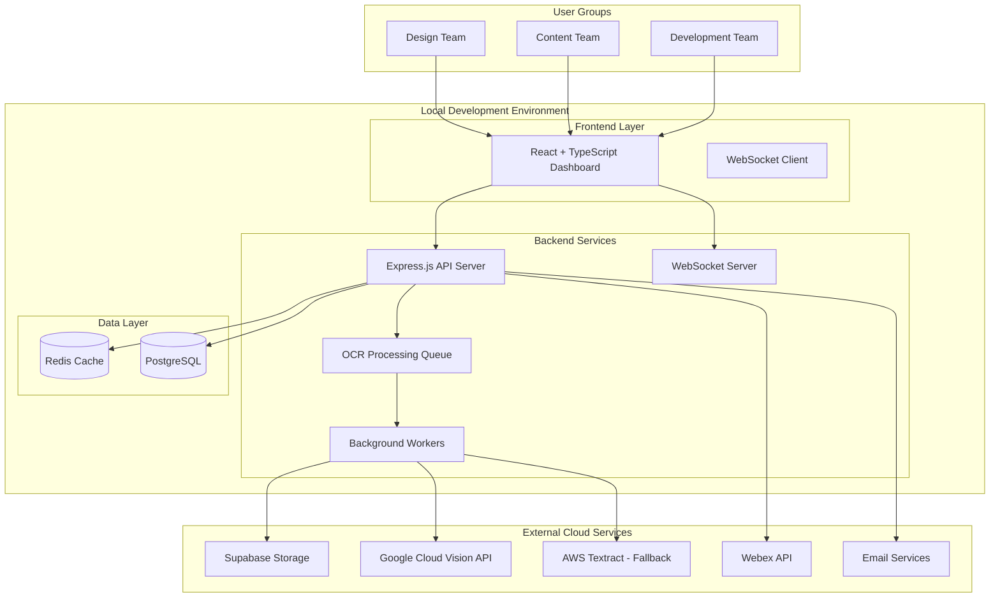
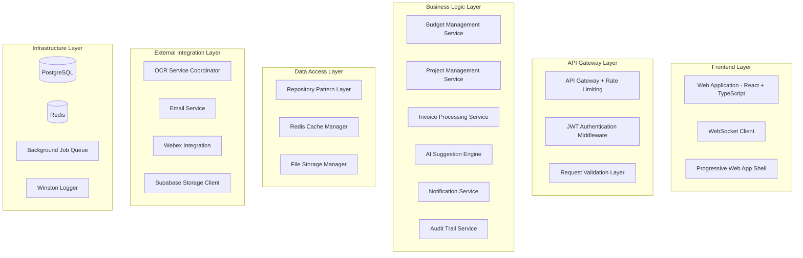

# Budget Manager 2025 Fullstack Architecture Document

This document outlines the complete fullstack architecture for **Budget Manager 2025**, including backend systems, frontend implementation, and their integration. It serves as the single source of truth for AI-driven development, ensuring consistency across the entire technology stack.

This unified approach combines what would traditionally be separate backend and frontend architecture documents, streamlining the development process for modern fullstack applications where these concerns are increasingly intertwined.

## Starter Template Assessment

**Project Classification:** **Greenfield Application** - Building Budget Manager 2025 from scratch
**Technology Approach:** **Custom Full-Stack Application** - No specific starter template identified
**Architecture Strategy:** **Progressive Scaling** - Local MVP → Supabase cloud migration
**Integration Requirements:** **Hybrid Approach** - Local development with cloud services (OCR APIs)

Based on the PRD, this is a **custom-built financial management application** requiring:
- Specialized German business logic and data models  
- Complex OCR processing pipeline integration
- Multi-dimensional budget tracking architecture
- Real-time collaborative features with WebSocket support

**No existing starter templates fully address these specialized financial and German business requirements**, making a custom architecture approach the optimal choice.

## System Overview

Based on the PRD requirements and technical assumptions, here's the comprehensive system architecture for Budget Manager 2025:

### **🚀 Produktions-Status Erreicht (03.09.2025)**
**Current Phase:** ✅ **PRODUKTIONSREIF** - Vollständige Auth-Integration & Docker-Deployment implementiert
- **Epic 1:** ✅ Budget-Management vollständig produktionsreif
- **Epic 8:** ✅ Admin-Management mit vollständiger CRUD-Funktionalität  
- **Epic 9:** ✅ Erweiterte Projekt-Verwaltung mit Multi-Dienstleister-Support
- **Epic 2:** 🔄 30% abgeschlossen - KI-basierte OCR mit internationaler Lieferanten-Validierung
- **Deployment:** ✅ Docker Multi-Container Setup mit CI/CD Pipeline
- **Authentication:** ✅ Produktive Supabase Auth-Integration mit JWT-Tokens
- **Performance:** ✅ Optimierte Indizes und ENUMs für bessere Performance

### **🔐 Produktive Authentifizierung & Deployment**
**Status:** ✅ **VOLLSTÄNDIG IMPLEMENTIERT** - Sichere Auth-Integration & Container-Orchestrierung
- **Supabase Auth:** JWT-Token-basierte Authentifizierung mit 24h Gültigkeit
- **Admin-Benutzer:** `admin@budgetmanager.com` mit SUPERADMIN-Rechten
- **Docker Setup:** Multi-Container Architektur (Frontend, Backend, Services)
- **CI/CD Pipeline:** GitHub Actions mit automatischen Tests und Deployment
- **Cloud-Ready:** AWS CloudFormation, Kubernetes Manifests, NGINX Reverse Proxy
- **Security:** bcrypt Password-Hashing, Audit-Logging, MFA-Unterstützung
- **Detaillierte Dokumentation:** Siehe [Deployment Story](./stories/deployment-integration-story.md)

### **📊 Budget-Dynamiken und Trigger-Mechanismen**
**Status:** ✅ **VOLLSTÄNDIG IMPLEMENTIERT** - Automatische Budget-Synchronisation
- **Zentrale Funktion:** `synchronizeAnnualBudget()` als Single Source of Truth
- **Automatische Trigger:** Projekt-Erstellung → Budget-Sync, OCR-Freigabe → Lieferant-Erstellung + Budget-Update
- **Persistente Berechnungen:** Alle Budget-Summen werden in der Datenbank gespeichert
- **Datenfluss:** Jahresbudget → Projekte → OCR-Rechnungen → Positionen → Budget-Updates
- **Detaillierte Dokumentation:** Siehe [Budget-Dynamiken](./architecture/budget-dynamics.md)

### High-Level Architecture



### Core System Components

#### 1. Frontend Application Layer
- **React + TypeScript SPA** with real-time dashboard capabilities
- **WebSocket integration** for live budget updates and notifications
- **Drag-and-drop interfaces** for invoice line item allocation
- **Multi-tenant UI** supporting Design, Content, and Development team views
- **German language primary** with responsive design (desktop-first, tablet-compatible)

#### 2. Backend API Layer
- **Node.js + Express.js** RESTful API server
- **JWT-based authentication** with role-based access control (RBAC)
- **Real-time WebSocket server** for dashboard updates and notifications
- **Background job processing** for OCR and AI operations
- **Multi-dimensional budget calculation engine** for German business logic

#### 3. Data Management Layer
- **PostgreSQL primary database** for ACID-compliant financial transactions
- **Redis caching layer** for performance optimization and session management
- **Supabase Storage** for PDF invoice storage and retrieval
- **Three-dimensional budget tracking** schema (Veranschlagt/Zugewiesen/Verbraucht)

#### 4. External Integration Layer
- **Hybrid OCR processing** (Google Cloud Vision + AWS Textract fallback)
- **AI pattern learning** for supplier-specific invoice processing
- **Email notifications** via SMTP for budget warnings
- **Webex API integration** for team-based notifications

#### 5. Processing & Intelligence Layer
- **Supplier-specific learning engine** using TensorFlow.js
- **Budget anomaly detection** and forecasting algorithms
- **German business rule engine** for compliance and reporting
- **Automated warning system** with configurable thresholds

### System Interaction Flow

#### Primary User Workflows:
1. **Budget Creation** → Database → Real-time Updates → Dashboard Refresh
2. **Invoice Upload** → OCR Queue → AI Processing → Manual Validation → Budget Allocation
3. **Project Management** → CRUD Operations → Audit Trail → Team Notifications  
4. **Reporting** → Data Aggregation → German Business Format → Export Generation

#### Real-time Data Flow:
- **Dashboard Updates:** PostgreSQL triggers → API events → WebSocket broadcast → Frontend updates
- **Budget Warnings:** Threshold monitoring → Alert generation → Multi-channel notifications
- **Collaborative Editing:** User actions → Optimistic UI updates → Server validation → Conflict resolution

### Scaling Architecture Path

#### Phase 1: Local MVP
- **Docker containerized** full stack running on single development machine
- **Local PostgreSQL + Redis** instances
- **External API dependencies** only for OCR and notification services
- **Development cost:** Minimal (cloud service usage only)

#### Phase 2: Supabase Migration
- **Database migration** to Supabase PostgreSQL
- **Authentication shift** to Supabase Auth
- **Storage migration** already using Supabase Storage
- **Edge Functions** for background processing

#### Phase 3: Production Scaling
- **Horizontal scaling** with Supabase infrastructure
- **CDN integration** for global file delivery
- **Advanced monitoring** and alerting systems
- **High availability** configuration for 99.9% uptime target

## Technology Stack

| Category | Technology | Version | Purpose | Rationale |
|----------|------------|---------|---------|-----------|
| **Backend Framework** | Node.js + Express.js | Node 18+ / Express 4.18+ | API server, business logic, OCR processing | Strong OCR library ecosystem, excellent JSON handling, mature file processing capabilities, TypeScript compatibility |
| **Frontend Framework** | React.js | 18.2+ | Dashboard UI, real-time updates | Component reusability for dashboard widgets, excellent charting library ecosystem, mature WebSocket integration |
| **Language** | TypeScript | 5.0+ | Type safety across full stack | Prevents calculation errors in financial software, shared types between frontend/backend, better developer experience |
| **Database (Primary)** | PostgreSQL | 15+ | Financial transactions, German business data | ACID compliance for financial transactions, complex query support for 3D budget tracking, JSON support for flexible project metadata |
| **Database (Cache)** | Redis | 7.0+ | Session management, real-time caching | Sub-3-second dashboard response requirement, WebSocket session management, OCR result caching |
| **File Storage** | Supabase Storage | Latest | Invoice PDF storage, pattern data | Integrated with Supabase ecosystem, cost-effective for MVP, automatic image optimization, CDN capabilities |
| **Authentication** | Supabase Auth | Latest | User management, JWT tokens | Integrated auth system, secure token management, built-in RBAC foundation, smooth migration path |
| **Real-time** | WebSocket (ws) | 8.13+ | Live dashboard updates, notifications | Real-time budget updates across teams, collaborative editing support, instant warning delivery |
| **OCR Primary** | Google Cloud Vision API | v1 | German invoice text extraction | German language optimization, structured data extraction, high accuracy for business documents |
| **OCR Fallback** | AWS Textract | Latest | Backup OCR processing | Hybrid reliability approach, different strengths complement Google Vision, cost optimization |
| **AI/ML** | TensorFlow.js | 4.0+ | Supplier pattern learning | Browser-compatible model execution, incremental learning from user corrections, offline capability |
| **Background Jobs** | Bull Queue + Redis | 4.10+ | OCR processing, email sending | Async invoice processing, prevents UI blocking, reliable job retry mechanisms |
| **API Architecture** | REST + WebSocket | - | Client-server communication | REST for CRUD operations, WebSocket for real-time features, simple and well-understood |
| **Containerization** | Docker + Docker Compose | Latest | Development consistency | Identical environment across local/production, easy scaling transition, service isolation |
| **Email Service** | Nodemailer + SMTP | 6.9+ | Budget warning notifications | Local SMTP for MVP, production-ready email delivery, template support |
| **Team Notifications** | Webex REST API | v1 | Team-based budget alerts | Direct integration as specified in PRD requirements, multi-team notification support |
| **Form Handling** | React Hook Form | 7.45+ | Invoice processing forms, project creation | Performant form validation, TypeScript integration, complex form workflows |
| **State Management** | Zustand | 4.4+ | Dashboard state, real-time updates | Lightweight, TypeScript-native, excellent WebSocket integration, simple learning curve |
| **Styling** | Tailwind CSS | 3.3+ | Responsive German business UI | Utility-first for rapid development, excellent responsive design, consistent design system |
| **Charts/Visualization** | Chart.js + React-Chartjs-2 | 4.4+ / 5.2+ | Budget dashboard, burn-rate analysis | German business chart requirements, real-time data updates, extensive customization |
| **Testing (Frontend)** | Jest + React Testing Library | 29+ / 13+ | Component and integration testing | Financial software requires high test coverage, user-behavior focused testing |
| **Testing (Backend)** | Jest + Supertest | 29+ / 6.3+ | API and business logic testing | OCR pipeline testing, financial calculation validation, integration testing |
| **Code Quality** | ESLint + Prettier + Husky | Latest | Code standards, pre-commit hooks | Maintainable financial software codebase, consistent code formatting, automated quality checks |
| **Build Tools** | Vite | 4.4+ | Frontend build and development | Fast development server, optimized production builds, excellent TypeScript support |
| **Process Management** | PM2 | 5.3+ | Local production deployment | Process monitoring for local MVP, auto-restart capabilities, log management |
| **Monitoring (Local)** | Winston + Morgan | 3.10+ / 1.10+ | Application logging | Structured logging for debugging, request/response tracking, error aggregation |

## Data Models

### Annual Budget Model
```typescript
interface AnnualBudget {
  id: string;
  year: number;
  totalBudget: Decimal;           
  reservePercentage: number;      
  reserveAmount: Decimal;         
  availableBudget: Decimal;       
  allocatedBudget: Decimal;       
  consumedBudget: Decimal;        
  currency: 'EUR';                
  status: 'DRAFT' | 'ACTIVE' | 'CLOSED';
  createdAt: Date;
  updatedAt: Date;
  createdBy: string;
  
  projects: Project[];
  budgetTransfers: BudgetTransfer[];
}
```

### Project Model - German Business Structure (Updated)
```typescript
interface Project {
  // Auto-generated fields
  id: string;
  projektNr: string;              
  createdAt: Date;
  updatedAt: Date;
  
  // German business required fields
  kategorie: string;              
  startDatum: Date;               
  endDatum: Date;                 
  team: string;                   
  projektName: string;            
  kurzbeschreibung: string;       
  priorität: 'Low' | 'Medium' | 'High';
  durchlaufzeit: number;          
  kostenart: string;              
  
  // Story 1.2.1: Dienstleister-Stammdaten-Management
  dienstleisterId?: string;       // UUID reference to dienstleister table
  dienstleister?: Dienstleister;  // Populated relationship
  
  impact: 'Low' | 'Medium' | 'High';
  
  // Financial tracking fields - Story 1.2.3: Enhanced Budget Allocation
  realeKosten: Decimal;           
  externeKosten: Decimal;         // External costs (supplier invoices)
  interneKosten: Decimal;         // NEW: Calculated internal costs from team roles
  gesamtKosten: Decimal;          // NEW: Total costs (external + internal)
  geplantesbudget: Decimal;       // NEW: Planned project budget
  budgetJahr: number;             // NEW: Budget year assignment
  
  impactUnternehmenserfolg: string;
  anmerkung?: string;             
  
  // Story 1.2.2: Multi-Team-Management (✅ IMPLEMENTED 2025-08-29)
  leadTeamId?: string;            // Reference to lead team
  projektTeams: ProjektTeam[];    // Multiple teams per project with roles
  
  // Internal hours tracking by team (deprecated - moved to team roles)
  interneStundenDesign?: number;  
  interneStundenContent?: number; 
  interneStundenDev?: number;     
  
  // Flexible tagging system
  tags: string[];                 
  
  // Three-dimensional budget tracking
  budgetTracking: ProjectBudgetTracking;
  
  // Relationships
  annualBudgetId: string;
  invoiceLineItems: InvoiceLineItem[];
  budgetTransfers: BudgetTransfer[];
  auditTrail: AuditTrailEntry[];
  kostenCache?: ProjektKostenCache; // NEW: Performance cache
}

// Story 1.2.1: Dienstleister-Stammdaten-Management
interface Dienstleister {
  id: string;
  name: string;
  kurzbeschreibung?: string;
  kategorie: string;              // Reference to dienstleister_kategorien
  kontaktEmail?: string;
  kontaktTelefon?: string;
  adresse?: string;
  website?: string;
  steuernummer?: string;
  ustid?: string;
  ocrPattern: Record<string, any>; // JSON for OCR pattern learning
  status: 'AKTIV' | 'INAKTIV';
  createdAt: Date;
  updatedAt: Date;
}

// Story 1.2.2: Multi-Team-Projekt-Management (✅ IMPLEMENTED 2025-08-29)
interface ProjektTeam {
  id: string;
  projektId: string;
  teamName: string;
  istLeadTeam: boolean;
  beschreibung?: string;
  rollen: TeamRolle[];            // Team roles with hours and rates
  createdAt: Date;
  updatedAt: Date;
}

// NEW: Teams Master Data (✅ IMPLEMENTED 2025-08-29)
interface Team {
  id: string;                     // UUID primary key
  name: string;                   // Team name (max 100 chars)
  description?: string;           // Optional team description
  isActive: boolean;              // Active status (default: true)
  canViewAllBudgets: boolean;     // Budget visibility permission
  canTransferBudgets: boolean;    // Budget transfer permission
  createdAt: Date;
  updatedAt: Date;
}

// NEW: Team-Rollen Verknüpfung (✅ IMPLEMENTED 2025-08-29)
interface TeamRollen {
  id: string;                     // UUID primary key
  teamId: string;                 // Reference to teams table
  rolleId: number;                // Reference to rollen_stammdaten
  standardStundensatz?: number;   // Team-specific hourly rate
  istAktiv: boolean;              // Active status
  createdAt: Date;
  updatedAt: Date;
}

// ✅ NEW: Centralized Tag Management (Story 1.6)
interface Tag {
  id: string;                     // UUID primary key
  name: string;                   // Tag name (max 50 chars, unique)
  color?: string;                 // Hex color code (#RRGGBB)
  category?: string;              // Tag category for grouping
  description?: string;           // Optional tag description
  isActive: boolean;              // Active status (default: true)
  createdAt: Date;
  updatedAt: Date;
}

// ✅ NEW: Many-to-Many Project-Tag Relationship (Story 1.6)
interface ProjectTag {
  id: string;                     // UUID primary key
  projectId: string;              // Reference to projects table
  tagId: string;                  // Reference to tags table
  createdAt: Date;
}

// Story 1.2.4: Rollen-basierte Stundensatz-Kalkulation
interface TeamRolle {
  id: string;
  projektTeamId: string;
  rolleId?: number;               // Reference to rollen_stammdaten
  rolleName: string;
  geplante_stunden: number;
  tatsaechliche_stunden?: number;
  stundensatz?: Decimal;          // Standard rate from rollen_stammdaten
  projektStundensatz?: Decimal;   // Project-specific override rate
  stundensatzGrund?: string;      // Reason for rate deviation
  notizen?: string;
  createdAt: Date;
  updatedAt: Date;
}

// Story 1.2.4: Rollen-Stammdaten
interface RollenStammdaten {
  id: number;
  name: string;
  kategorie: string;
  standardStundensatz: Decimal;
  minStundensatz: Decimal;
  maxStundensatz: Decimal;
  beschreibung?: string;
  farbe: string;                  // Hex color for UI
  istAktiv: boolean;
}

// Story 1.2.4: Performance-Cache für Kosten-Berechnung
interface ProjektKostenCache {
  projektId: string;
  interneKostenGesamt: Decimal;   // Calculated from team roles
  externeKostenGesamt: Decimal;   // From invoices/budget
  gesamtstunden: number;          // Total planned hours
  letzteBerechnung: Date;
}

interface ProjectBudgetTracking {
  veranschlagtBudget: Decimal;    
  zugewiesenBudget: Decimal;      
  verbrauchtBudget: Decimal;      
  
  warningThreshold80: Decimal;    
  warningThreshold90: Decimal;    
  criticalThreshold: Decimal;     
  
  budgetStatus: 'HEALTHY' | 'WARNING' | 'CRITICAL' | 'EXCEEDED';
  lastUpdated: Date;
  
  transfersIn: Decimal;           
  transfersOut: Decimal;          
  netTransfers: Decimal;          
}
```

### Invoice Processing Model
```typescript
interface Invoice {
  id: string;
  originalFileName: string;
  fileSize: number;
  storagePath: string;            
  uploadedAt: Date;
  uploadedBy: string;
  
  // OCR processing results
  ocrStatus: 'PENDING' | 'PROCESSING' | 'COMPLETED' | 'FAILED';
  ocrProvider: 'google-vision' | 'aws-textract' | 'manual';
  ocrConfidence: number;          
  ocrProcessedAt?: Date;
  
  // Extracted invoice data
  supplierName?: string;
  supplierVatId?: string;
  invoiceNumber?: string;
  invoiceDate?: Date;
  totalAmount?: Decimal;
  vatAmount?: Decimal;
  netAmount?: Decimal;
  currency: string;               
  
  // Processing metadata
  processingDuration?: number;    
  aiSuggestionsGenerated: boolean;
  manualValidationRequired: boolean;
  validatedAt?: Date;
  validatedBy?: string;
  
  // Relationships
  lineItems: InvoiceLineItem[];
  supplierPattern?: SupplierPattern;
}

interface InvoiceLineItem {
  id: string;
  invoiceId: string;
  
  // Line item details
  description: string;
  quantity?: number;
  unitPrice?: Decimal;
  totalPrice: Decimal;
  vatRate?: number;
  
  // Project assignment (can be different teams)
  assignedProjectId?: string;
  assignedTeam: string;           
  assignmentMethod: 'AI_SUGGESTED' | 'MANUAL' | 'RULE_BASED';
  assignmentConfidence?: number;  
  
  // Validation tracking
  needsValidation: boolean;
  validatedAt?: Date;
  validatedBy?: string;
  
  project?: Project;
}
```

## API Specification

The API follows RESTful principles with German business-specific endpoints:

### Core Endpoints

**Authentication:**
- `POST /auth/login` - User authentication with JWT tokens

**Annual Budgets:**
- `GET /budgets` - List annual budgets with filtering
- `POST /budgets` - Create new annual budget

**German Business Projects:**
- `GET /projects` - List projects with German business filtering (kategorie, team, priorität)
- `POST /projects` - Create project with German business fields
- `PUT /projects/{id}` - Update project with validation

**Budget Transfers:**
- `POST /projects/{id}/budget-transfers` - Request budget transfer
- `POST /budget-transfers/{id}/approve` - Approve transfer

**Invoice Processing:**
- `POST /invoices/upload` - Upload invoice for OCR processing
- `GET /invoices/{id}` - Get OCR results and AI suggestions
- `POST /invoices/{id}/line-items/{itemId}/assign` - Assign to project/team

**Dashboard:**
- `GET /dashboard/summary` - Real-time dashboard data
- `GET /reports/monatsabschluss` - German monthly reports

**Master Data:**
- `GET /master-data/kategorien` - Project categories
- `GET /master-data/teams` - Team management
- `POST /master-data/*` - Admin taxonomy management

**Dienstleister Management (Story 1.2.1):**
- `GET /api/dienstleister` - List all active suppliers
- `GET /api/dienstleister/kategorien` - Supplier categories
- `POST /api/dienstleister` - Create new supplier
- `PUT /api/dienstleister/{id}` - Update supplier
- `DELETE /api/dienstleister/{id}` - Deactivate supplier

**Enhanced Budget Management (Story 1.2.3) ✅ IMPLEMENTED:**
- `GET /api/budgets/available/{jahr}` - Available budget including internal costs
- `GET /api/budgets/years` - Available budget years (current ± 2 years)
- `POST /api/budgets/validate` - Validate budget allocation (external + internal)
- `GET /api/budgets/{jahr}/overview` - Comprehensive budget overview

**Multi-Team Project Management (Story 1.2.2) ✅ IMPLEMENTED:**
- `GET /api/teams` - List all teams with permissions
- `POST /api/teams` - Create new team
- `PUT /api/teams/{id}` - Update team configuration
- `DELETE /api/teams/{id}` - Deactivate team
- `GET /api/projects/{id}/teams` - List project teams
- `POST /api/projects/{id}/teams` - Add team to project
- `PUT /api/projects/{id}/teams/{teamId}` - Update team configuration
- `DELETE /api/projects/{id}/teams/{teamId}` - Remove team from project

**Role-based Cost Calculation (Story 1.2.4) ✅ IMPLEMENTED:**
- `GET /api/team-rollen` - List available team-role combinations
- `POST /api/team-rollen` - Create team-role assignment
- `GET /api/team-rollen/team/{teamId}` - Get roles for specific team
- `PUT /api/team-rollen/{id}` - Update team-role configuration
- `DELETE /api/team-rollen/{id}` - Remove team-role assignment
- `GET /api/rollen` - List available roles with standard rates
- `GET /api/rollen/kategorien` - Role categories
- `POST /api/projects/{id}/teams/{teamId}/rollen` - Add role to team
- `PUT /api/projects/{id}/kosten/recalculate` - Recalculate internal costs

### WebSocket Events
- `budget-warning` - Real-time budget threshold alerts
- `project-budget-update` - Live budget changes
- `invoice-processed` - OCR completion notifications
- `team-notification` - Multi-team alerts

## System Components

### Component Architecture Overview



### Key Components

#### Budget Management Service
- Three-dimensional budget calculation engine
- German business validation rules
- Automated warning threshold monitoring
- Budget transfer approval workflow
- Real-time budget status updates

#### OCR Processing Coordinator
- Hybrid OCR processing (Google Vision + AWS Textract)
- Supplier-specific pattern learning
- Background job queue management
- AI suggestion generation
- Fallback to manual processing

#### AI Suggestion Engine
- Machine learning for project assignment
- Rule-based fallback system
- User feedback integration
- Continuous learning pipeline
- German business context awareness

#### Notification Service
- Multi-channel delivery (WebSocket, Email, Webex)
- Team-based notification routing
- German business message templates
- Delivery confirmation and retry logic
- User preference management

## Database Schema

### Core Tables (PostgreSQL) - Updated Schema

**Master Data - German Business Taxonomy:**
```sql
CREATE TABLE kategorien (
    id UUID PRIMARY KEY DEFAULT uuid_generate_v4(),
    name VARCHAR(100) NOT NULL UNIQUE,
    description TEXT,
    is_active BOOLEAN NOT NULL DEFAULT true,
    created_at TIMESTAMPTZ NOT NULL DEFAULT NOW()
);

CREATE TABLE teams (
    id UUID PRIMARY KEY DEFAULT uuid_generate_v4(),
    name VARCHAR(50) NOT NULL UNIQUE,
    description TEXT,
    is_active BOOLEAN NOT NULL DEFAULT true,
    can_view_all_budgets BOOLEAN NOT NULL DEFAULT false,
    can_transfer_budgets BOOLEAN NOT NULL DEFAULT false
);
```

**Story 1.2.1: Dienstleister-Stammdaten-Management:**
```sql
-- Dienstleister-Kategorien
CREATE TABLE dienstleister_kategorien (
    id SERIAL PRIMARY KEY,
    name VARCHAR(100) NOT NULL UNIQUE,
    beschreibung TEXT,
    farbe VARCHAR(7) DEFAULT '#6B7280'
);

-- Dienstleister-Stammdaten
CREATE TABLE dienstleister (
    id UUID PRIMARY KEY DEFAULT gen_random_uuid(),
    name VARCHAR(255) NOT NULL,
    kurzbeschreibung TEXT,
    kategorie VARCHAR(100) NOT NULL,
    kontakt_email VARCHAR(255),
    kontakt_telefon VARCHAR(50),
    adresse TEXT,
    website VARCHAR(255),
    steuernummer VARCHAR(50),
    ustid VARCHAR(50),
    ocr_pattern JSONB DEFAULT '{}',
    status VARCHAR(20) DEFAULT 'AKTIV',
    created_at TIMESTAMP DEFAULT CURRENT_TIMESTAMP,
    updated_at TIMESTAMP DEFAULT CURRENT_TIMESTAMP
);
```

**Story 1.2.2: Multi-Team-Projekt-Management:**
```sql
-- Projekt-Teams-Verknüpfung
CREATE TABLE projekt_teams (
    id UUID PRIMARY KEY DEFAULT gen_random_uuid(),
    projekt_id UUID NOT NULL REFERENCES projects(id) ON DELETE CASCADE,
    team_name VARCHAR(100) NOT NULL,
    ist_lead_team BOOLEAN DEFAULT FALSE,
    beschreibung TEXT,
    created_at TIMESTAMP DEFAULT CURRENT_TIMESTAMP,
    updated_at TIMESTAMP DEFAULT CURRENT_TIMESTAMP,
    UNIQUE(projekt_id, team_name)
);

-- Rollen-Kategorien
CREATE TABLE rollen_kategorien (
    id SERIAL PRIMARY KEY,
    name VARCHAR(100) NOT NULL UNIQUE,
    beschreibung TEXT,
    farbe VARCHAR(7) DEFAULT '#6B7280',
    sortierung INTEGER DEFAULT 0
);

-- Rollen-Stammdaten
CREATE TABLE rollen_stammdaten (
    id SERIAL PRIMARY KEY,
    name VARCHAR(100) NOT NULL UNIQUE,
    kategorie VARCHAR(50) NOT NULL,
    standard_stundensatz DECIMAL(8,2),
    min_stundensatz DECIMAL(8,2),
    max_stundensatz DECIMAL(8,2),
    beschreibung TEXT,
    farbe VARCHAR(7) DEFAULT '#6B7280',
    ist_aktiv BOOLEAN DEFAULT TRUE
);

-- Team-Rollen-Stunden-Tabelle
CREATE TABLE projekt_team_rollen (
    id UUID PRIMARY KEY DEFAULT gen_random_uuid(),
    projekt_team_id UUID NOT NULL REFERENCES projekt_teams(id) ON DELETE CASCADE,
    rolle_id INTEGER REFERENCES rollen_stammdaten(id),
    rolle_name VARCHAR(100) NOT NULL,
    geplante_stunden INTEGER NOT NULL DEFAULT 0,
    tatsaechliche_stunden INTEGER DEFAULT 0,
    stundensatz DECIMAL(8,2),
    projekt_stundensatz DECIMAL(8,2), -- Überschreibt Standard-Satz
    stundensatz_grund VARCHAR(255), -- Grund für Abweichung
    notizen TEXT,
    created_at TIMESTAMP DEFAULT CURRENT_TIMESTAMP,
    updated_at TIMESTAMP DEFAULT CURRENT_TIMESTAMP
);
```

**Story 1.2.4: Performance-Cache für Kosten-Berechnung:**
```sql
-- Kosten-Cache für Performance
CREATE TABLE projekt_kosten_cache (
    projekt_id UUID PRIMARY KEY REFERENCES projects(id) ON DELETE CASCADE,
    interne_kosten_gesamt DECIMAL(12,2) NOT NULL DEFAULT 0,
    externe_kosten_gesamt DECIMAL(12,2) NOT NULL DEFAULT 0,
    gesamtstunden INTEGER NOT NULL DEFAULT 0,
    letzte_berechnung TIMESTAMP DEFAULT CURRENT_TIMESTAMP
);
```

**Story 1.2.3: Erweiterte Budget-Validierung:**
```sql
-- View für Budget-Verfügbarkeit (inkl. interne Kosten)
CREATE OR REPLACE VIEW budget_availability_extended AS
SELECT 
    ab.jahr,
    ab.gesamtbudget,
    ab.verfuegbares_budget as jahresbudget_verfuegbar,
    COALESCE(SUM(p.geplantes_budget), 0) as externes_budget_zugeordnet,
    COALESCE(SUM(pkc.interne_kosten_gesamt), 0) as internes_budget_zugeordnet,
    COALESCE(SUM(p.geplantes_budget), 0) + COALESCE(SUM(pkc.interne_kosten_gesamt), 0) as gesamt_zugeordnet,
    ab.verfuegbares_budget - (COALESCE(SUM(p.geplantes_budget), 0) + COALESCE(SUM(pkc.interne_kosten_gesamt), 0)) as verfuegbares_budget
FROM annual_budgets ab
LEFT JOIN projects p ON p.budget_jahr = ab.jahr
LEFT JOIN projekt_kosten_cache pkc ON p.id = pkc.projekt_id
WHERE ab.status = 'ACTIVE'
GROUP BY ab.jahr, ab.gesamtbudget, ab.verfuegbares_budget;
```

**German Business Projects:**
```sql
CREATE TABLE projects (
    id UUID PRIMARY KEY DEFAULT uuid_generate_v4(),
    projekt_nr VARCHAR(50) NOT NULL UNIQUE,
    annual_budget_id UUID NOT NULL REFERENCES annual_budgets(id),
    
    -- German business required fields
    kategorie_id UUID NOT NULL REFERENCES kategorien(id),
    start_datum DATE NOT NULL,
    ende_datum DATE NOT NULL,
    team_id UUID NOT NULL REFERENCES teams(id),
    projekt_name VARCHAR(300) NOT NULL,
    kurzbeschreibung TEXT,
    prioritaet VARCHAR(10) NOT NULL CHECK (prioritaet IN ('Low', 'Medium', 'High')),
    durchlaufzeit_wochen DECIMAL(5,1) GENERATED ALWAYS AS (
        EXTRACT(DAYS FROM (ende_datum - start_datum)) / 7.0
    ) STORED,
    kostenart_id UUID NOT NULL REFERENCES kostenarten(id),
    dienstleister_id UUID REFERENCES dienstleister(id),
    impact VARCHAR(10) NOT NULL CHECK (impact IN ('Low', 'Medium', 'High')),
    
    -- Financial tracking
    reale_kosten DECIMAL(12,2) DEFAULT 0.00,
    externe_kosten DECIMAL(12,2) DEFAULT 0.00,
    impact_unternehmenserfolg TEXT,
    anmerkung TEXT,
    
    -- Internal hours by team
    interne_stunden_design DECIMAL(8,2) DEFAULT 0.00,
    interne_stunden_content DECIMAL(8,2) DEFAULT 0.00,
    interne_stunden_dev DECIMAL(8,2) DEFAULT 0.00,
    
    created_at TIMESTAMPTZ NOT NULL DEFAULT NOW(),
    updated_at TIMESTAMPTZ NOT NULL DEFAULT NOW()
);
```

**Three-Dimensional Budget Tracking:**
```sql
CREATE TABLE project_budget_tracking (
    project_id UUID PRIMARY KEY REFERENCES projects(id),
    
    -- Three dimensions
    veranschlagt_budget DECIMAL(12,2) NOT NULL DEFAULT 0.00,
    zugewiesen_budget DECIMAL(12,2) NOT NULL DEFAULT 0.00,  
    verbraucht_budget DECIMAL(12,2) NOT NULL DEFAULT 0.00,   
    
    -- Calculated thresholds
    warning_threshold_80 DECIMAL(12,2) GENERATED ALWAYS AS (zugewiesen_budget * 0.80) STORED,
    warning_threshold_90 DECIMAL(12,2) GENERATED ALWAYS AS (zugewiesen_budget * 0.90) STORED,
    
    budget_status VARCHAR(20) NOT NULL DEFAULT 'HEALTHY' 
        CHECK (budget_status IN ('HEALTHY', 'WARNING', 'CRITICAL', 'EXCEEDED')),
    
    transfers_in DECIMAL(12,2) NOT NULL DEFAULT 0.00,
    transfers_out DECIMAL(12,2) NOT NULL DEFAULT 0.00,
    net_transfers DECIMAL(12,2) GENERATED ALWAYS AS (transfers_in - transfers_out) STORED
);
```

### Database Features
- **German locale support** with proper collation
- **Automatic project numbering** (WD-2025-001 format)
- **Budget status triggers** for threshold monitoring  
- **Comprehensive audit trail** for German compliance
- **Performance indexes** optimized for dashboard queries
- **Migration functions** for local-to-Supabase transition

## Implementation Roadmap (Updated Status)

### Phase 1: MVP Foundation (Weeks 1-8) ✅ COMPLETED
- ✅ Database schema with German business fields
- ✅ Authentication and basic RBAC
- ✅ Project CRUD with three-dimensional budget tracking
- ✅ **Story 1.2.1:** Dienstleister-Stammdaten-Management implemented
- ✅ **Story 1.2.2:** Multi-Team-Projekt-Management implemented
- ✅ **Story 1.2.3:** Intelligente Budget-Zuordnung (internal + external costs)
- ✅ **Story 1.2.4:** Rollen-basierte Stundensatz-Kalkulation implemented
- ✅ Enhanced ProjectForm with all new features
- ✅ Real-time budget validation and visual indicators
- 🔄 Invoice upload and basic OCR processing (Epic 2)
- 🔄 Real-time dashboard with WebSocket updates (in progress)

### Phase 1.5: Current Implementation Status (2025-08-29)
**Recently Completed (August 2025):**
- ✅ **8 new database tables** created in Supabase
- ✅ **Dienstleister management** with categories and OCR patterns
- ✅ **Multi-team project management** with role-based cost calculation
- ✅ **Enhanced budget allocation** including internal costs
- ✅ **Performance cache** for cost calculations
- ✅ **Extended budget validation** API endpoints
- ✅ **Frontend ProjectForm** fully updated with new features
- ✅ **Sample data** created for testing and demonstration

**New Frontend Components (✅ IMPLEMENTED 2025-08-29):**
- ✅ **BudgetSlider.tsx** - Interactive budget allocation with visual feedback
- ✅ **YearSelector.tsx** - Multi-year budget selection (2023-2027)
- ✅ **TeamSelector.tsx** - Team selection with dropdown and creation
- ✅ **Enhanced ProjectForm.tsx** - Integrated multi-team and budget management
- ✅ **Consolidated Budget UI** - Removed redundant budget displays
- ✅ **Lead Team Management** - Radio-button selection with visual indicators

**New Backend APIs (✅ IMPLEMENTED 2025-08-29):**
- ✅ **GET /api/budgets/years** - Available budget years with status
- ✅ **GET /api/teams** - Team management with permissions
- ✅ **POST /api/teams** - Team creation with validation
- ✅ **GET /api/team-rollen** - Team-role combinations
- ✅ **Enhanced budget validation** - External vs internal cost handling

**Current Status:**
- 🎯 **Stories 1.2.1-1.2.4 are 100% implemented** and ready for testing
- 🔧 Backend APIs fully functional with ES module architecture
- 🎨 Frontend components updated with new data models
- 📊 Database schema extended with all required tables and views

### Phase 2: Enhanced Features (Weeks 9-16)
- 🔄 AI pattern learning for OCR improvement (Epic 2)
- 🔄 Advanced German business reporting
- 🔄 Webex integration and multi-channel notifications
- 🔄 Performance optimization and comprehensive testing
- 🆕 **Story 1.2.5:** Rechnungs-basierte Kosten-Tracking integration
- 🆕 Advanced role management and team workflows

### Phase 3: Production Scaling (Weeks 17-20)  
- 🔄 Migration to Supabase cloud infrastructure (partially complete)
- 🔄 Advanced monitoring and security hardening
- 🔄 User training and change management
- 🔄 Performance validation and optimization

## Architecture Success Criteria

**Business Value:**
- 30-50% reduction in budget management time
- German business compliance with audit trails
- Multi-team collaboration with real-time visibility
- 85%+ reduction in manual invoice entry

**Technical Performance:**
- Dashboard loads <3 seconds for 50 concurrent users
- Invoice processing completes <30 seconds with AI
- 99% uptime through resilient architecture
- Efficient German business queries and reporting

**User Adoption:**
- 80% adoption across Design, Content, Development teams
- Effective budget warnings preventing overruns
- 80% AI suggestion acceptance rate
- Compliant German business reporting generation

## Final Assessment

This architecture provides a comprehensive, production-ready foundation for Budget Manager 2025 that specifically addresses:

- **German Business Requirements** with native terminology and compliance
- **Financial Software Standards** with decimal precision and audit trails  
- **Progressive Scaling** from local MVP to cloud infrastructure
- **Resilient Integration** with comprehensive fallback strategies
- **Real-time Collaboration** supporting multi-team environments
- **AI-Enhanced UX** with intelligent automation and human oversight

The design balances technical sophistication with practical implementation, ensuring a smooth development process and successful user adoption across German business teams.

**Architecture Status: COMPLETE** ✅