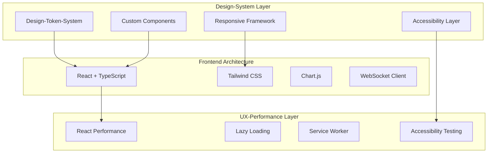
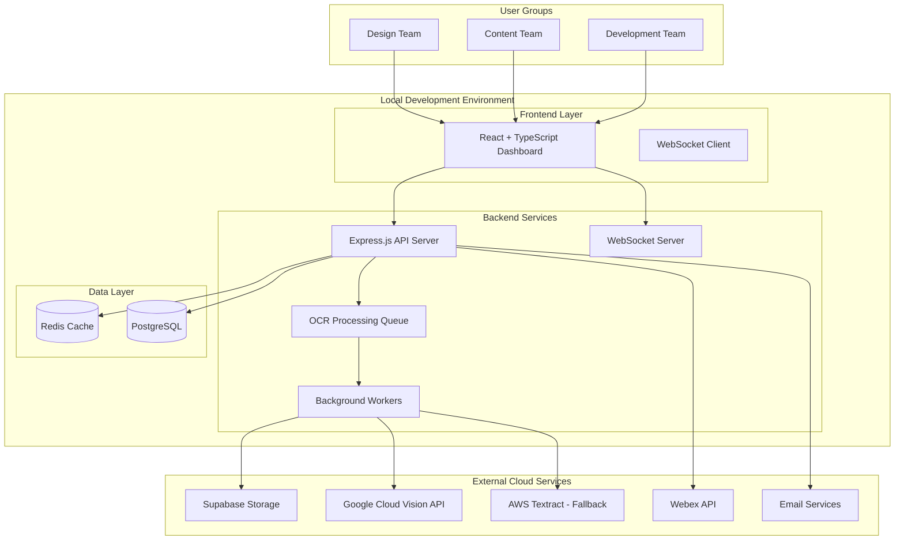

# System-Übersicht - Budget Manager 2025 Fullstack Architektur

Dieses Dokument beschreibt die vollständige Fullstack-Architektur für **Budget Manager 2025**, einschließlich Backend-Systemen, Frontend-Implementierung und deren Integration. Es dient als einzige Quelle der Wahrheit für KI-getriebene Entwicklung und gewährleistet Konsistenz über den gesamten Technologie-Stack.

Dieser einheitliche Ansatz kombiniert, was traditionell separate Backend- und Frontend-Architekturdokumente wären, und rationalisiert den Entwicklungsprozess für moderne Fullstack-Anwendungen, wo diese Belange zunehmend miteinander verwoben sind.

## Starter Template Assessment

**Projekt-Klassifikation:** **Greenfield Application** - Budget Manager 2025 von Grund auf neu erstellen
**Technologie-Ansatz:** **Custom Full-Stack Application** - Kein spezifisches Starter-Template identifiziert
**Architektur-Strategie:** **Progressive Scaling** - Lokales MVP → Supabase Cloud-Migration
**Integrations-Anforderungen:** **Hybrid Approach** - Lokale Entwicklung mit Cloud-Services (OCR APIs)

Basierend auf dem PRD ist dies eine **maßgeschneiderte Finanzmanagement-Anwendung**, die folgendes erfordert:
- Spezialisierte deutsche Geschäftslogik und Datenmodelle  
- Komplexe OCR-Verarbeitungs-Pipeline-Integration
- Multi-dimensionale Budget-Tracking-Architektur
- Echtzeit-kollaborative Features mit WebSocket-Unterstützung

**Keine bestehenden Starter-Templates adressieren vollständig diese spezialisierten Finanz- und deutschen Geschäftsanforderungen**, was einen benutzerdefinierten Architektur-Ansatz zur optimalen Wahl macht.

## 🎨 **UI/UX-Architektur Integration**

### **Design-System-Architektur:**
Das Budget Manager 2025-System integriert ein **konsistentes Design-System** in die Fullstack-Architektur:

### **Deutsche Geschäfts-UI-Standards:**
- **EUR-Formatierung:** €1.250.000,00 mit deutschen Tausendertrennzeichen
- **Ampelsystem:** 🟢 Gesund (0-80%), 🟡 Warnung (81-95%), 🔴 Kritisch (96%+)
- **Deutsche Terminologie:** Veranschlagt, Zugewiesen, Verbraucht
- **Responsive Design:** Desktop (3-4 Spalten), Tablet (2 Spalten), Mobile (1 Spalte)

## High-Level Architektur

## Kern-System-Komponenten

### 1. Frontend Application Layer
- **React + TypeScript SPA** mit Echtzeit-Dashboard-Funktionen
- **WebSocket-Integration** für Live-Budget-Updates und Benachrichtigungen
- **Drag-and-Drop-Interfaces** für Rechnungsposten-Zuordnung
- **Multi-Tenant-UI** unterstützt Design-, Content- und Entwicklungsteam-Ansichten
- **Deutsche Sprache primär** mit responsivem Design (Desktop-first, Tablet-kompatibel)

### 2. Backend API Layer
- **Node.js + Express.js** RESTful API Server
- **JWT-basierte Authentifizierung** mit rollenbasierter Zugriffskontrolle (RBAC)
- **Echtzeit-WebSocket-Server** für Dashboard-Updates und Benachrichtigungen
- **Hintergrund-Job-Verarbeitung** für OCR- und KI-Operationen
- **Multi-dimensionale Budget-Berechnungs-Engine** für deutsche Geschäftslogik

### 3. Data Management Layer
- **PostgreSQL primäre Datenbank** für ACID-konforme Finanztransaktionen
- **Redis-Caching-Layer** für Performance-Optimierung und Session-Management
- **Supabase Storage** für PDF-Rechnungs-Speicherung und -Abruf
- **Dreidimensionales Budget-Tracking** Schema (Veranschlagt/Zugewiesen/Verbraucht)

### 4. External Integration Layer
- **Hybride OCR-Verarbeitung** (Google Cloud Vision + AWS Textract Fallback)
- **KI-Pattern-Learning** für lieferantenspezifische Rechnungsverarbeitung
- **E-Mail-Benachrichtigungen** via SMTP für Budget-Warnungen
- **Webex API Integration** für teambasierte Benachrichtigungen

### 5. Processing & Intelligence Layer
- **Lieferantenspezifische Lern-Engine** mit TensorFlow.js
- **Budget-Anomalie-Erkennung** und Forecasting-Algorithmen
- **Deutsche Geschäftsregel-Engine** für Compliance und Reporting
- **Automatisiertes Warnsystem** mit konfigurierbaren Schwellenwerten

## System-Interaktions-Flow

### Primäre Benutzer-Workflows:
1. **Budget-Erstellung** → Datenbank → Echtzeit-Updates → Dashboard-Refresh
2. **Rechnungs-Upload** → OCR-Queue → KI-Verarbeitung → Manuelle Validierung → Budget-Zuordnung
3. **Projekt-Management** → CRUD-Operationen → Audit-Trail → Team-Benachrichtigungen  
4. **Reporting** → Daten-Aggregation → Deutsche Geschäftsformat → Export-Generierung

### Echtzeit-Daten-Flow:
- **Dashboard-Updates:** PostgreSQL-Trigger → API-Events → WebSocket-Broadcast → Frontend-Updates
- **Budget-Warnungen:** Schwellenwert-Monitoring → Alert-Generierung → Multi-Channel-Benachrichtigungen
- **Kollaborative Bearbeitung:** Benutzer-Aktionen → Optimistische UI-Updates → Server-Validierung → Konflikt-Resolution

## Skalierungs-Architektur-Pfad

### Phase 1: Lokales MVP
- **Docker containerisiert** Full Stack auf einzelner Entwicklungsmaschine laufend
- **Lokale PostgreSQL + Redis** Instanzen
- **Externe API-Abhängigkeiten** nur für OCR- und Benachrichtigungs-Services
- **Entwicklungskosten:** Minimal (nur Cloud-Service-Nutzung)

### Phase 2: Supabase Migration
- **Datenbank-Migration** zu Supabase PostgreSQL
- **Authentifizierungs-Wechsel** zu Supabase Auth
- **Storage-Migration** bereits Supabase Storage verwendet
- **Edge Functions** für Hintergrundverarbeitung

### Phase 3: Produktions-Skalierung
- **Horizontale Skalierung** mit Supabase-Infrastruktur
- **CDN-Integration** für globale Datei-Bereitstellung
- **Erweiterte Monitoring** und Alerting-Systeme
- **Hochverfügbarkeits**-Konfiguration für 99,9% Uptime-Ziel