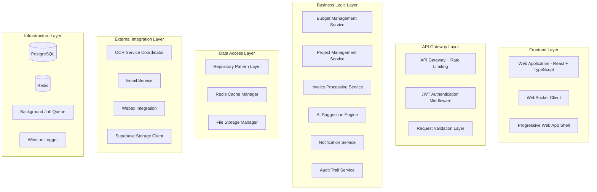

# System-Komponenten - Budget Manager 2025

## Komponenten-Architektur-Übersicht



## Schlüssel-Komponenten

### Budget Management Service
**Zweck:** Kern-Geschäftslogik für deutsche Budget-Verwaltung
**Verantwortlichkeiten:**
- Dreidimensionale Budget-Berechnungs-Engine (Veranschlagt/Zugewiesen/Verbraucht)
- Deutsche Geschäfts-Validierungsregeln
- Automatisierte Warnungs-Schwellenwert-Überwachung
- Budget-Transfer-Genehmigungsworkflow
- Echtzeit-Budget-Status-Updates

**Kern-Methoden:**
```typescript
class BudgetManagementService {
  calculateBudgetStatus(projectId: string): BudgetStatus
  validateBudgetTransfer(transfer: BudgetTransferRequest): ValidationResult
  processThresholdWarnings(): Promise<Warning[]>
  approveBudgetTransfer(transferId: string, approverId: string): Promise<void>
  generateBurnRateAnalysis(projectId: string, timeframe: string): BurnRateData
}
```

### OCR Processing Coordinator
**Zweck:** Koordiniert hybride OCR-Verarbeitung mit Fallback-Strategien
**Verantwortlichkeiten:**
- Hybride OCR-Verarbeitung (Google Vision + AWS Textract)
- Lieferantenspezifisches Pattern-Learning
- Hintergrund-Job-Queue-Management
- KI-Vorschlagsgenerierung
- Fallback auf manuelle Verarbeitung

**Workflow:**
```typescript
class OCRProcessingCoordinator {
  async processInvoice(invoiceId: string): Promise<OCRResult> {
    // 1. Dokument-Preprocessing
    const preprocessed = await this.preprocessDocument(invoiceId);
    
    // 2. Primäre OCR (Google Vision)
    let ocrResult = await this.googleVisionOCR(preprocessed);
    
    // 3. Fallback bei niedriger Konfidenz
    if (ocrResult.confidence < 0.85) {
      ocrResult = await this.awsTextractOCR(preprocessed);
    }
    
    // 4. Lieferanten-Pattern anwenden
    const enhanced = await this.applySupplierPattern(ocrResult);
    
    // 5. KI-Vorschläge generieren
    const suggestions = await this.generateAISuggestions(enhanced);
    
    return { ...enhanced, suggestions };
  }
}
```

### AI Suggestion Engine
**Zweck:** Maschinelles Lernen für Projekt-Zuordnungs-Vorschläge
**Verantwortlichkeiten:**
- Machine Learning für Projektzuordnung
- Regelbasiertes Fallback-System
- Benutzer-Feedback-Integration
- Kontinuierliche Lern-Pipeline
- Deutsche Geschäftskontext-Bewusstsein

**ML-Pipeline:**
```typescript
class AISuggestionEngine {
  async generateProjectSuggestions(lineItem: InvoiceLineItem): Promise<ProjectSuggestion[]> {
    // 1. Feature-Extraktion
    const features = this.extractFeatures(lineItem);
    
    // 2. Lieferanten-Pattern-Matching
    const patternMatch = await this.matchSupplierPattern(lineItem.invoice.supplierName);
    
    // 3. Historische Analyse
    const historicalSuggestions = await this.analyzeHistoricalAssignments(features);
    
    // 4. ML-Modell-Vorhersage
    const mlPredictions = await this.mlModel.predict(features);
    
    // 5. Konfidenz-Bewertung kombinieren
    return this.combineAndRankSuggestions(patternMatch, historicalSuggestions, mlPredictions);
  }
  
  async learnFromUserFeedback(correction: UserCorrection): Promise<void> {
    await this.updateSupplierPattern(correction);
    await this.retrainModel(correction);
  }
}
```

### Notification Service
**Zweck:** Multi-Channel-Benachrichtigungs-Bereitstellung
**Verantwortlichkeiten:**
- Multi-Channel-Bereitstellung (WebSocket, E-Mail, Webex)
- Teambasierte Benachrichtigungs-Weiterleitung
- Deutsche Geschäfts-Nachrichten-Templates
- Bereitstellungs-Bestätigung und Retry-Logik
- Benutzer-Präferenz-Management

**Channel-Strategie:**
```typescript
class NotificationService {
  async sendBudgetWarning(warning: BudgetWarning): Promise<void> {
    const channels = await this.determineChannels(warning);
    
    // Sofortige WebSocket-Benachrichtigung
    if (channels.includes('websocket')) {
      await this.websocketNotifier.send(warning);
    }
    
    // E-Mail für persistente Benachrichtigung
    if (channels.includes('email')) {
      await this.emailNotifier.send(warning);
    }
    
    // Webex für Team-Koordination
    if (channels.includes('webex')) {
      await this.webexNotifier.send(warning);
    }
  }
  
  private async determineChannels(warning: BudgetWarning): Promise<string[]> {
    const user = await this.getUserPreferences(warning.userId);
    const urgency = this.calculateUrgency(warning);
    
    return this.channelSelector.select(user.preferences, urgency);
  }
}
```

### Project Management Service
**Zweck:** Deutsche Geschäftsprojekt-Verwaltung
**Verantwortlichkeiten:**
- Vollständige deutsche Geschäftsfeld-Validierung
- Projekt-Lifecycle-Management
- Interne Stunden-Tracking nach Teams
- Tag-basierte Kategorisierung
- Projekt-zu-Budget-Beziehungs-Management

**Deutsche Geschäfts-Validierung:**
```typescript
class ProjectManagementService {
  validateGermanBusinessFields(project: ProjectInput): ValidationResult {
    const errors: ValidationError[] = [];
    
    // Pflichtfeld-Validierung
    if (!project.kategorie) errors.push({ field: 'kategorie', message: 'Kategorie ist erforderlich' });
    if (!project.team) errors.push({ field: 'team', message: 'Team-Zuordnung ist erforderlich' });
    
    // Datum-Validierung
    if (project.startDatum >= project.endDatum) {
      errors.push({ field: 'endDatum', message: 'Enddatum muss nach Startdatum liegen' });
    }
    
    // Durchlaufzeit-Berechnung
    const calculatedWeeks = this.calculateDurchlaufzeit(project.startDatum, project.endDatum);
    if (Math.abs(calculatedWeeks - project.durchlaufzeit) > 0.1) {
      errors.push({ field: 'durchlaufzeit', message: 'Durchlaufzeit stimmt nicht mit Datumsspanne überein' });
    }
    
    return { isValid: errors.length === 0, errors };
  }
}
```

### Audit Trail Service
**Zweck:** Deutsche Geschäfts-Compliance-Audit-Trails
**Verantwortlichkeiten:**
- Umfassende Änderungs-Verfolgung
- Deutsche Compliance-Anforderungen
- Unveränderliche Audit-Logs
- Benutzer-Aktivitäts-Monitoring
- Forensische Analyse-Unterstützung

**Audit-Implementierung:**
```typescript
class AuditTrailService {
  async logChange(change: AuditableChange): Promise<void> {
    const auditEntry: AuditTrailEntry = {
      id: generateUUID(),
      entityType: change.entityType,
      entityId: change.entityId,
      action: change.action,
      fieldChanges: this.calculateFieldChanges(change.oldValue, change.newValue),
      performedBy: change.userId,
      performedAt: new Date(),
      ipAddress: change.ipAddress,
      userAgent: change.userAgent,
      complianceNote: this.generateComplianceNote(change),
      approvalRequired: this.requiresApproval(change)
    };
    
    // Unveränderlicher Speicher
    await this.auditRepository.create(auditEntry);
    
    // Compliance-Benachrichtigung bei kritischen Änderungen
    if (auditEntry.approvalRequired) {
      await this.notificationService.sendComplianceAlert(auditEntry);
    }
  }
}
```

### File Storage Manager
**Zweck:** Sichere PDF-Rechnung und Pattern-Daten-Verwaltung
**Verantwortlichkeiten:**
- Supabase Storage Integration
- Datei-Upload-Validierung
- Verschlüsselte Speicherung
- CDN-Optimierung
- Backup und Recovery

### Cache Manager
**Zweck:** Performance-Optimierung mit Redis
**Verantwortlichkeiten:**
- Dashboard-Daten-Caching
- Session-Management
- OCR-Ergebnis-Zwischenspeicherung
- Real-time Update-Koordination

### Background Job Queue
**Zweck:** Asynchrone Verarbeitung mit Bull Queue
**Verantwortlichkeiten:**
- OCR-Verarbeitungs-Jobs
- E-Mail-Versendungs-Queue
- KI-Model-Training-Jobs
- Bericht-Generierungs-Tasks
- Cleanup und Wartungs-Jobs

## Komponenten-Interaktions-Matrix

| Komponente | Budget Service | OCR Coordinator | AI Engine | Notification | Project Service |
|------------|----------------|-----------------|-----------|--------------|-----------------|
| **Budget Service** | - | ❌ | ❌ | ✅ Warnungen | ✅ Budget-Updates |
| **OCR Coordinator** | ❌ | - | ✅ Vorschläge | ✅ Status | ❌ |
| **AI Engine** | ❌ | ✅ Ergebnisse | - | ❌ | ✅ Zuordnungen |
| **Notification** | ✅ Empfängt | ✅ Empfängt | ❌ | - | ✅ Empfängt |
| **Project Service** | ✅ Budget-Daten | ❌ | ✅ Kontext | ✅ Updates | - |

**Legende:**
- ✅ Direkte Interaktion
- ❌ Keine direkte Interaktion
- - Selbstreferenz