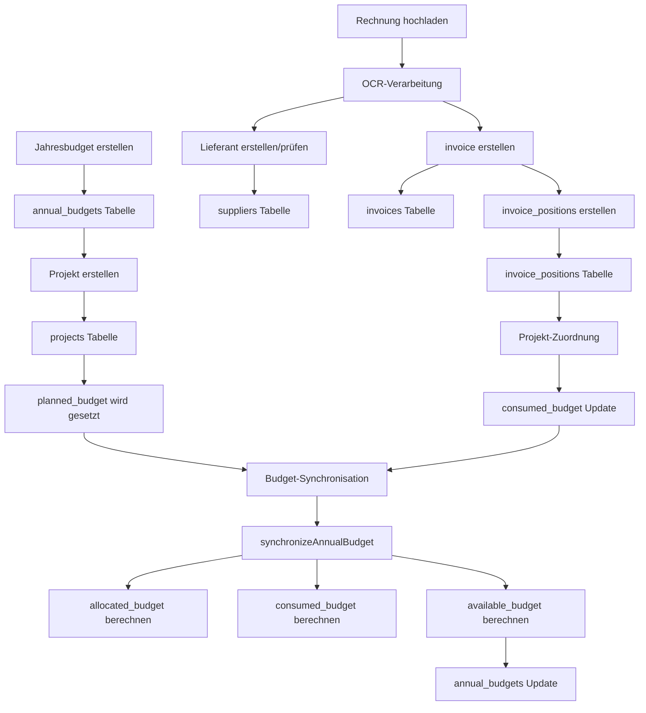

# 📊 Budget-Dynamiken und Trigger-Mechanismen

## Übersicht

Das Budget Manager 2025 System implementiert eine **vollautomatische Budget-Synchronisation** mit klaren Datenflüssen und Trigger-Mechanismen. Alle Berechnungen werden in der Datenbank gespeichert und durch die zentrale `synchronizeAnnualBudget()` Funktion verwaltet.

## 🏗️ Datenbank-Architektur

### Zentrale Tabellen

#### `annual_budgets` (Jahresbudgets)
```sql
- id: UUID (Primary Key)
- year: INTEGER (z.B. 2025)
- total_budget: DECIMAL (Vom User festgelegtes Gesamtbudget)
- allocated_budget: DECIMAL (Automatisch berechnet: SUM aller planned_budgets)
- consumed_budget: DECIMAL (Automatisch berechnet: SUM aller consumed_budgets)
- available_budget: DECIMAL (Automatisch berechnet: total_budget - allocated_budget)
- status: TEXT ('ACTIVE', 'INACTIVE')
- updated_at: TIMESTAMP (Letzte Synchronisation)
```

#### `projects` (Projekte)
```sql
- id: UUID (Primary Key)
- annual_budget_id: UUID (Foreign Key zu annual_budgets)
- planned_budget: DECIMAL (Geplantes Projektbudget)
- consumed_budget: DECIMAL (Automatisch berechnet aus invoice_positions)
- available_budget: DECIMAL (Berechnet: planned_budget - consumed_budget)
```

#### `invoice_positions` (Rechnungspositionen)
```sql
- id: UUID (Primary Key)
- project_id: UUID (Foreign Key zu projects)
- total_amount: DECIMAL (Positionsbetrag)
- tax_amount: DECIMAL (MwSt-Betrag)
```

## 🔄 Datenfluss-Architektur



## 🎯 Trigger-Mechanismen

### 1. Jahresbudget-Erstellung
**Auslöser:** User erstellt neues Jahresbudget
**Tabelle:** `annual_budgets`
**Aktion:**
```javascript
{
  total_budget: userInput,
  allocated_budget: 0,
  consumed_budget: 0,
  available_budget: total_budget,
  status: 'ACTIVE'
}
```

### 2. Projekt-Erstellung
**Auslöser:** User erstellt neues Projekt
**Tabelle:** `projects`
**Trigger:** `synchronizeAnnualBudget(annual_budget_id)`
**Berechnung:**
```javascript
allocated_budget += project.planned_budget
available_budget = total_budget - allocated_budget
```

### 3. OCR-Rechnungsverarbeitung
**Auslöser:** POST `/api/ocr-review/session/:id/approve`
**Ablauf:**
1. **Lieferant prüfen/erstellen** → `suppliers` Tabelle
2. **Rechnung erstellen** → `invoices` Tabelle  
3. **Positionen erstellen** → `invoice_positions` Tabelle
4. **Projekt-Zuordnung** → `consumed_budget` Update
5. **Budget-Synchronisation** → `synchronizeAnnualBudget()`

### 4. Budget-Synchronisation (Zentrale Funktion)
**Funktion:** `synchronizeAnnualBudget(annualBudgetId)`
**Auslöser:** Jede budget-relevante Änderung
**Berechnung:**
```javascript
const allocated_budget = SUM(projects.planned_budget WHERE annual_budget_id = X)
const consumed_budget = SUM(projects.consumed_budget WHERE annual_budget_id = X)  
const available_budget = total_budget - allocated_budget

// Update in Datenbank
UPDATE annual_budgets SET 
  allocated_budget = calculated_allocated,
  consumed_budget = calculated_consumed,
  available_budget = calculated_available,
  updated_at = NOW()
WHERE id = annualBudgetId
```

## 📈 Budget-Feld-Dynamiken

### `allocated_budget` (Allokiertes Budget)
- **Steigt:** Neues Projekt wird erstellt oder planned_budget erhöht
- **Sinkt:** Projekt wird gelöscht oder planned_budget reduziert
- **Auslöser:** Projekt-CRUD-Operationen
- **Berechnung:** `SUM(projects.planned_budget WHERE annual_budget_id = X)`

### `consumed_budget` (Verbrauchtes Budget)
- **Steigt:** Rechnungsposition wird Projekt zugeordnet
- **Sinkt:** Rechnungsposition wird entfernt oder geändert
- **Auslöser:** OCR-Freigabe, manuelle Position-Bearbeitung
- **Berechnung:** `SUM(projects.consumed_budget WHERE annual_budget_id = X)`

### `available_budget` (Verfügbares Budget)
- **Verändert sich:** Bei jeder allocated_budget Änderung
- **Auslöser:** Projekt-Erstellung/-Löschung
- **Berechnung:** `total_budget - allocated_budget`

### `project.consumed_budget` (Projekt-Verbrauch)
- **Steigt:** Neue Rechnungsposition zugeordnet
- **Sinkt:** Rechnungsposition entfernt
- **Auslöser:** OCR-Freigabe, Position-CRUD
- **Berechnung:** `SUM(invoice_positions.total_amount WHERE project_id = X)`

## 🔧 Implementierung

### Backend-Controller Verantwortlichkeiten

#### `budgetController.js`
- **`synchronizeAnnualBudget()`** - Zentrale Berechnungslogik
- **`getAllAnnualBudgets()`** - Lädt Budgets mit aktuellen Berechnungen
- **`getAnnualBudgetById()`** - Einzelbudget mit Projekt-Details

#### `projectController.js`
- **Projekt-CRUD** mit automatischer Budget-Synchronisation
- **Budget-Updates** bei Projekt-Änderungen

#### `ocrReviewRoutes.js`
- **Lieferanten-Erstellung** aus OCR-Daten
- **Rechnungsposition-Zuordnung** zu Projekten
- **Automatische Budget-Updates** nach Freigabe

### Automatische Trigger-Kette

```javascript
// 1. Projekt erstellen
POST /api/projects → synchronizeAnnualBudget()

// 2. OCR-Rechnung freigeben  
POST /api/ocr-review/session/:id/approve → 
  createSupplier() → 
  createInvoice() → 
  createInvoicePositions() → 
  updateProjectConsumedBudget() → 
  synchronizeAnnualBudget()

// 3. Projekt löschen
DELETE /api/projects/:id → synchronizeAnnualBudget()
```

## ✅ Datenbank-Konsistenz

### Prinzipien
- **Single Source of Truth:** `synchronizeAnnualBudget()` ist die einzige Berechnungsquelle
- **Persistente Speicherung:** Alle Berechnungen werden in der Datenbank gespeichert
- **Keine Frontend-Berechnungen:** Frontend zeigt nur DB-Werte an
- **Automatische Synchronisation:** Jede Änderung triggert Neuberechnung

### Validierung
```sql
-- Prüfung der Budget-Konsistenz
SELECT 
  ab.year,
  ab.total_budget,
  ab.allocated_budget,
  ab.consumed_budget,
  ab.available_budget,
  -- Vergleich mit berechneten Werten
  COALESCE(SUM(p.planned_budget), 0) as calculated_allocated,
  COALESCE(SUM(p.consumed_budget), 0) as calculated_consumed,
  ab.total_budget - COALESCE(SUM(p.planned_budget), 0) as calculated_available
FROM annual_budgets ab
LEFT JOIN projects p ON p.annual_budget_id = ab.id
GROUP BY ab.id
ORDER BY ab.year DESC;
```

## 🚀 Vorteile der Architektur

1. **Vollautomatisch:** Keine manuellen Budget-Updates erforderlich
2. **Konsistent:** Alle Berechnungen aus einer Quelle
3. **Performant:** Vorberechnete Werte in der Datenbank
4. **Transparent:** Klare Trigger-Mechanismen
5. **Skalierbar:** Funktioniert mit beliebig vielen Projekten/Rechnungen
6. **Auditierbar:** Alle Änderungen werden getrackt

## 🔍 Debugging und Monitoring

### Backend-Logs
```javascript
console.log('📊 Budget-Berechnung für 2025:');
console.log('  💰 Gesamtbudget: 50000€');
console.log('  📋 Verplant: 25000€');
console.log('  💸 Verbraucht: 982.61€');
console.log('  💚 Verfügbar: 25000€');
```

### Monitoring-Queries
```sql
-- Aktuelle Budget-Status
SELECT year, total_budget, allocated_budget, consumed_budget, available_budget 
FROM annual_budgets WHERE status = 'ACTIVE';

-- Projekt-Budget-Verteilung
SELECT p.name, p.planned_budget, p.consumed_budget, p.available_budget
FROM projects p WHERE annual_budget_id = 'BUDGET_ID';
```

Diese Architektur gewährleistet eine **vollständig automatisierte und konsistente Budget-Verwaltung** im Budget Manager 2025 System.


