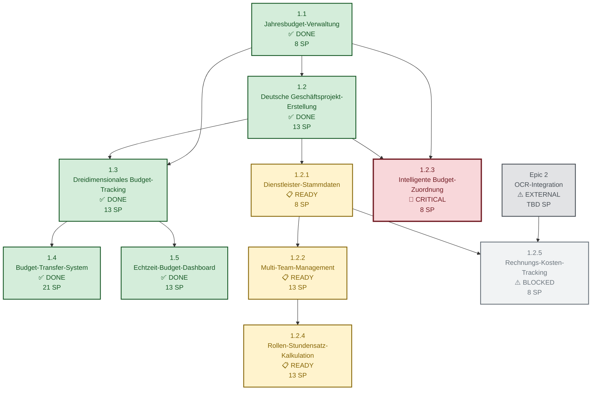
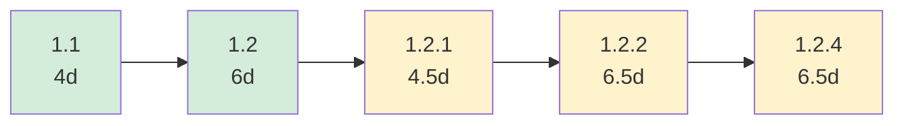
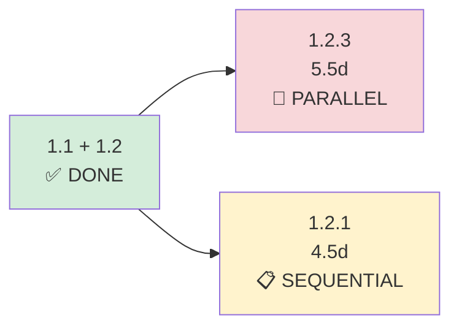
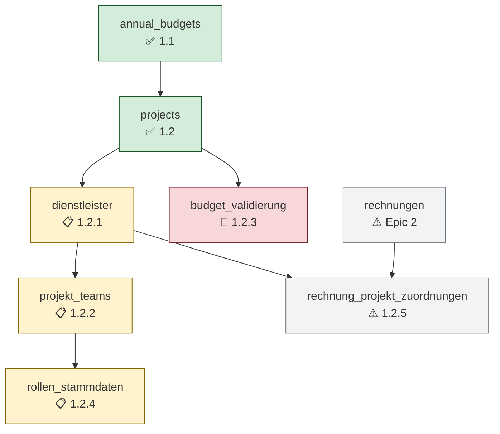
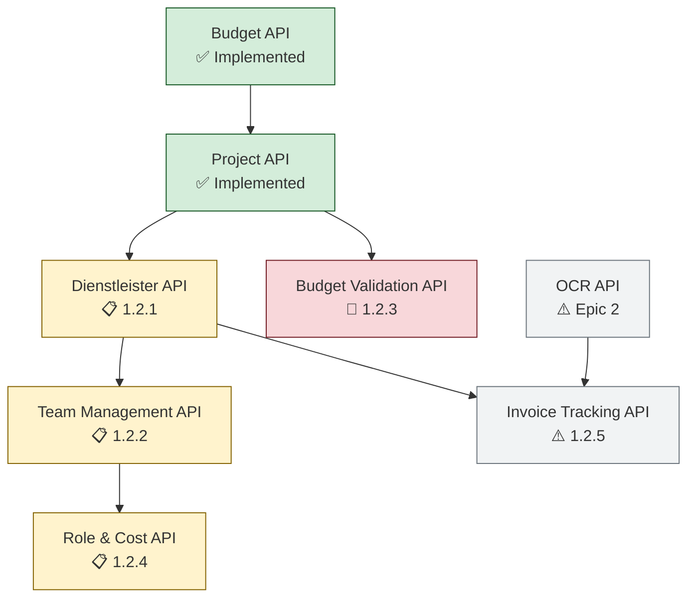
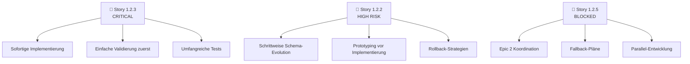
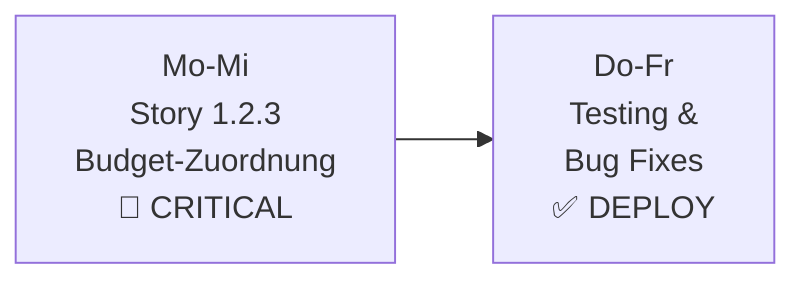
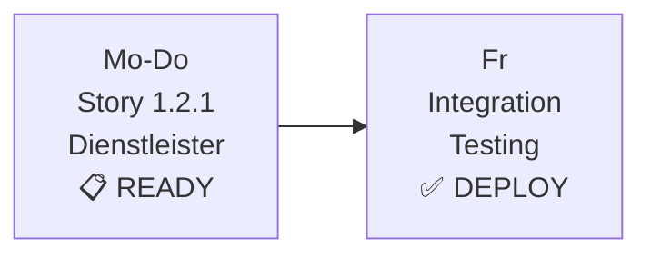

# Epic 1: Abhängigkeiten-Diagramm

**Letzte Aktualisierung:** 2025-01-15  
**Status:** 66% Completed (68/103 Story Points)

## 🔗 **Vollständiges Abhängigkeiten-Diagramm**



## 📊 **Sprint-Timeline-Diagramm**

```mermaid
gantt
    title Epic 1: Sprint-Timeline mit Abhängigkeiten
    dateFormat  X
    axisFormat %s
    
    section Abgeschlossen ✅
    1.1 Jahresbudget           :done, s1-1, 0, 4
    1.2 Geschäftsprojekt       :done, s1-2, 4, 10
    1.3 Budget-Tracking        :done, s2-1, 10, 16
    1.4 Transfer-System        :done, s2-2, 16, 26
    1.5 Dashboard              :done, s3-1, 20, 26
    
    section Sprint 4 🔴
    1.2.3 Budget-Zuordnung     :crit, s4-1, 26, 32
    1.2.1 Dienstleister        :active, s4-2, 32, 37
    
    section Sprint 5 🟠
    1.2.2 Multi-Team           :s5-1, 37, 44
    1.2.4 Rollen-Kosten (1/2)  :s5-2, 44, 48
    
    section Sprint 6 🟡
    1.2.4 Rollen-Kosten (2/2)  :s6-1, 48, 51
    1.2.5 Rechnungs-Tracking   :s6-2, 51, 55
```



## 🎯 **Kritische Pfad-Analyse**

### **Längster Pfad (27.5 Tage):**


### **Parallele Pfade:**


## 🔧 **Technische Abhängigkeiten-Matrix**

### **Database Schema Dependencies:**


### **API Dependencies:**


## ⚠️ **Risiko-Heatmap**

| Story | Tech Risk | Business Risk | Dependency Risk | **Total Risk** |
|-------|-----------|---------------|-----------------|----------------|
| 1.2.1 | 🟢 Low | 🟡 Medium | 🟢 Low | 🟢 **Low** |
| 1.2.2 | 🔴 High | 🟠 High | 🟡 Medium | 🔴 **High** |
| 1.2.3 | 🟡 Medium | 🔴 Critical | 🟢 Low | 🔴 **Critical** |
| 1.2.4 | 🟡 Medium | 🟡 Medium | 🟡 Medium | 🟡 **Medium** |
| 1.2.5 | 🟠 High | 🟡 Medium | 🔴 High | 🔴 **High** |

### **Risiko-Mitigation-Strategien:**


## 📈 **Implementierungs-Roadmap**

### **🔴 Woche 1 (SOFORT):**


### **🟠 Woche 2-3 (Sprint 4):**


### **🟠 Woche 4-5 (Sprint 5):**
```mermaid
graph LR
    A[Mo-Mi<br/>Story 1.2.2<br/>Multi-Team<br/>📋 HIGH RISK] --> B[Do-Fr<br/>Story 1.2.4<br/>Rollen (Start)<br/>📋 MEDIUM]
```

### **🟡 Woche 6-7 (Sprint 6):**
```mermaid
graph LR
    A[Mo-Mi<br/>Story 1.2.4<br/>Rollen (Ende)<br/>📋 MEDIUM] --> B[Do-Fr<br/>Story 1.2.5<br/>Rechnungen<br/>⚠️ IF Epic 2]
```

## 🎯 **Success Metrics & KPIs**

### **Sprint 4 Success Criteria:**
- ✅ Budget-Überschreitungen werden verhindert (1.2.3)
- ✅ Dienstleister-Dropdown funktioniert (1.2.1)
- ✅ OCR-Pattern-Vorbereitung abgeschlossen (1.2.1)
- 📊 **Target:** 16/35 SP completed (46% of extended stories)

### **Sprint 5 Success Criteria:**
- ✅ Multi-Team-Projekte erstellbar (1.2.2)
- ✅ Dynamische Team-Listen mit Add-Button (1.2.2)
- ✅ Automatische Kosten-Berechnung (1.2.4 Start)
- 📊 **Target:** 29/35 SP completed (83% of extended stories)

### **Epic 1 Complete Success Criteria:**
- ✅ Alle 10 Stories implementiert und getestet
- ✅ 103/103 Story Points abgeschlossen (100%)
- ✅ Vollständiges Budget-Management-System produktionsreif
- 📊 **Target:** Production-ready system with all features

---

## 📋 **Nächste Schritte:**

1. **🔴 SOFORT:** Story 1.2.3 implementieren (Budget-Zuordnung)
2. **📋 Sprint 4:** Story 1.2.1 implementieren (Dienstleister-Stammdaten)
3. **🔄 Koordination:** Epic 2 Timeline für Story 1.2.5 abstimmen
4. **📊 Monitoring:** Sprint-Fortschritt und Risiko-Mitigation überwachen

**Status: 68/103 SP (66%) | Kritischer Pfad: Story 1.2.3 🔴**

