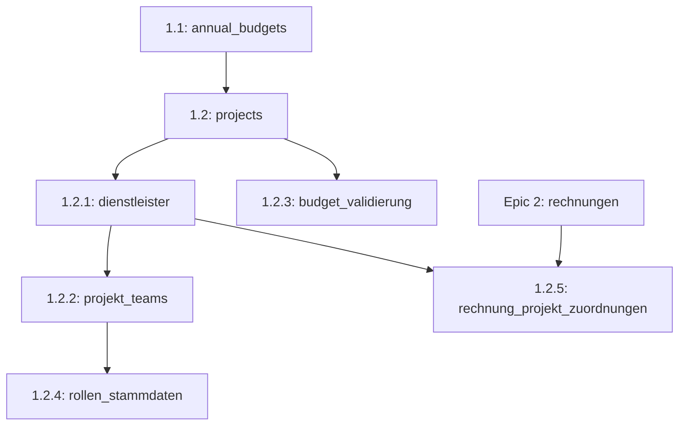
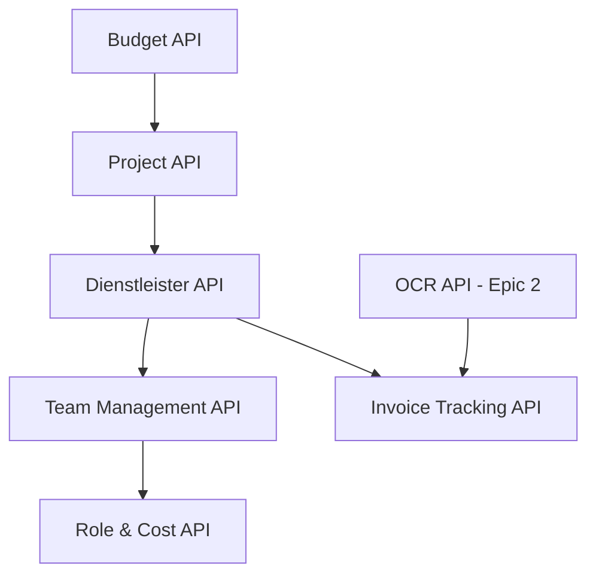
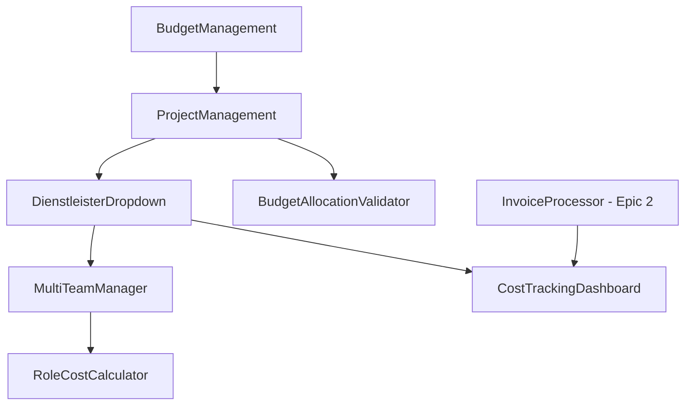

# Epic 1: Story-Übersicht mit Abhängigkeiten

**Letzte Aktualisierung:** 2025-01-15  
**Status:** 66% Completed (68/103 Story Points)

## 📋 **Vollständige Story-Matrix**

| Story | Titel | SP | Status | Priorität | Sprint | Dauer | Abhängigkeiten | Blocking |
|-------|-------|----|---------|-----------|---------|---------|--------------------|----------|
| **1.1** | Jahresbudget-Verwaltung | 8 | ✅ **Done** | 🔴 Kritisch | 1 | 4 Tage | - | 1.2, 1.2.3 |
| **1.2** | Deutsche Geschäftsprojekt-Erstellung | 13 | ✅ **Done** | 🔴 Kritisch | 1-2 | 6 Tage | 1.1 | 1.3, 1.2.1, 1.2.3 |
| **1.3** | Dreidimensionales Budget-Tracking | 13 | ✅ **Done** | 🟠 Hoch | 2 | 6 Tage | 1.1, 1.2 | 1.4, 1.5 |
| **1.4** | Budget-Transfer-System | 21 | ✅ **Done** | 🟠 Hoch | 2-3 | 10 Tage | 1.1, 1.2, 1.3 | - |
| **1.5** | Echtzeit-Budget-Dashboard | 13 | ✅ **Done** | 🟡 Mittel | 2-3 | 6 Tage | 1.3 | - |
| **1.2.1** | Dienstleister-Stammdaten-Management | 8 | 📋 **Ready** | 🟠 Hoch | 4 | 4.5 Tage | 1.2 | 1.2.2, 1.2.5 |
| **1.2.2** | Multi-Team-Projekt-Management | 13 | 📋 **Ready** | 🟠 Hoch | 4-5 | 6.5 Tage | 1.2.1 | 1.2.4 |
| **1.2.3** | Intelligente Budget-Zuordnung | 8 | 🔴 **Critical** | 🔴 Kritisch | 4 | 5.5 Tage | 1.1, 1.2 | - |
| **1.2.4** | Rollen-basierte Stundensatz-Kalkulation | 13 | 📋 **Ready** | 🟡 Mittel | 5 | 6.5 Tage | 1.2.2 | - |
| **1.2.5** | Rechnungs-basierte Kosten-Tracking | 8 | ⚠️ **Blocked** | 🟡 Niedrig | 6 | 4 Tage | Epic 2, 1.2.1 | - |

## 🔗 **Abhängigkeits-Ketten**

### **✅ Abgeschlossene Ketten:**
```
1.1 → 1.2 → 1.3 → 1.5 ✅ COMPLETED
1.1 → 1.2 → 1.3 → 1.4 ✅ COMPLETED
```

### **🚀 Neue Ketten (Erweiterte Stories):**
```
🔴 KRITISCH: 1.1 + 1.2 → 1.2.3 (SOFORT)
🟠 SEQUENZIELL: 1.2 → 1.2.1 → 1.2.2 → 1.2.4
⚠️ BLOCKED: Epic 2 + 1.2.1 → 1.2.5
```

## 📊 **Sprint-Abhängigkeiten-Matrix**

### **Sprint 1-3 (Abgeschlossen) ✅**
| Sprint | Stories | Abhängigkeiten erfüllt | Blocking aufgelöst |
|--------|---------|------------------------|-------------------|
| 1 | 1.1, 1.2 | ✅ Keine / 1.1 | ✅ 1.2, 1.2.3 freigegeben |
| 2 | 1.3, 1.4 (Start) | ✅ 1.1, 1.2 | ✅ 1.5, 1.4 (Ende) freigegeben |
| 3 | 1.4 (Ende), 1.5 | ✅ 1.3 | ✅ Kern-Epic abgeschlossen |

### **Sprint 4-6 (Geplant) 🚀**
| Sprint | Stories | Abhängigkeiten | Status | Risiko |
|--------|---------|----------------|--------|--------|
| **4** | 1.2.3, 1.2.1 | ✅ 1.1, 1.2 erfüllt | 🔴 **CRITICAL** | 🟢 Niedrig |
| **5** | 1.2.2, 1.2.4 (Start) | ⚠️ 1.2.1 erforderlich | 🟠 **HIGH** | 🟡 Mittel |
| **6** | 1.2.4 (Ende), 1.2.5 | ⚠️ Epic 2 + 1.2.1 | 🟡 **MEDIUM** | 🔴 Hoch |

## 🎯 **Kritische Pfad-Analyse**

### **Längster Pfad (Critical Path):**
```
1.1 (4d) → 1.2 (6d) → 1.2.1 (4.5d) → 1.2.2 (6.5d) → 1.2.4 (6.5d)
Gesamt: 27.5 Tage (5.5 Wochen)
```

### **Parallele Pfade:**
```
Pfad A: 1.1 → 1.2 → 1.2.3 (5.5d) ✅ Parallel möglich
Pfad B: Epic 2 → 1.2.5 (4d) ⚠️ Externe Abhängigkeit
```

### **Optimierungsmöglichkeiten:**
- **1.2.3** kann parallel zu **1.2.1** entwickelt werden
- **1.2.4** kann in 2 Sprints aufgeteilt werden (8 SP + 5 SP)
- **1.2.5** muss warten bis Epic 2 verfügbar ist

## 🔧 **Technische Abhängigkeiten**

### **Database Schema Dependencies:**


### **API Dependencies:**


### **Frontend Component Dependencies:**


## ⚠️ **Risiko-Matrix**

| Story | Technisches Risiko | Business Risiko | Abhängigkeits-Risiko | Gesamt-Risiko |
|-------|-------------------|-----------------|---------------------|---------------|
| **1.2.1** | 🟢 Niedrig | 🟡 Mittel | 🟢 Niedrig | 🟢 **Niedrig** |
| **1.2.2** | 🔴 Hoch | 🟠 Hoch | 🟡 Mittel | 🔴 **Hoch** |
| **1.2.3** | 🟡 Mittel | 🔴 Kritisch | 🟢 Niedrig | 🔴 **Kritisch** |
| **1.2.4** | 🟡 Mittel | 🟡 Mittel | 🟡 Mittel | 🟡 **Mittel** |
| **1.2.5** | 🟠 Hoch | 🟡 Mittel | 🔴 Hoch | 🔴 **Hoch** |

### **Risiko-Mitigation:**
- **1.2.2 (Hoch):** Schrittweise Schema-Evolution, umfangreiche Tests
- **1.2.3 (Kritisch):** Sofortige Implementierung, einfache Validierung zuerst
- **1.2.5 (Hoch):** Epic 2 Koordination, Fallback-Pläne

## 📈 **Implementierungs-Empfehlung**

### **🔴 Sofortige Aktion (Diese Woche):**
1. **Story 1.2.3** - Intelligente Budget-Zuordnung
   - **Grund:** Kritisches Business-Problem
   - **Aufwand:** 5.5 Tage
   - **Risiko:** Niedrig (keine komplexen Abhängigkeiten)

### **🟠 Sprint 4 (Nächste 2 Wochen):**
2. **Story 1.2.1** - Dienstleister-Stammdaten-Management
   - **Grund:** Vorbereitung für Epic 2, niedrige Komplexität
   - **Aufwand:** 4.5 Tage
   - **Parallel zu:** 1.2.3 (falls noch nicht abgeschlossen)

### **🟠 Sprint 5 (Wochen 3-4):**
3. **Story 1.2.2** - Multi-Team-Projekt-Management
   - **Grund:** Höchste Komplexität, benötigt 1.2.1
   - **Aufwand:** 6.5 Tage
   - **Risiko:** Hoch → Umfangreiche Tests erforderlich

### **🟡 Sprint 6 (Wochen 5-6):**
4. **Story 1.2.4** - Rollen-basierte Stundensatz-Kalkulation
   - **Grund:** Benötigt 1.2.2, mittlere Priorität
   - **Aufwand:** 6.5 Tage (aufteilen: 4 + 2.5 Tage)

### **⚠️ Sprint 7 (Nach Epic 2):**
5. **Story 1.2.5** - Rechnungs-basierte Kosten-Tracking
   - **Grund:** Epic 2 Abhängigkeit
   - **Aufwand:** 4 Tage
   - **Koordination:** Mit Epic 2 Team abstimmen

## 🎯 **Success Metrics**

### **Sprint 4 Ziele:**
- ✅ Budget-Überschreitungen werden verhindert (Story 1.2.3)
- ✅ Dienstleister können über Dropdown ausgewählt werden (Story 1.2.1)
- ✅ OCR-Pattern-Vorbereitung ist abgeschlossen (Story 1.2.1)

### **Sprint 5 Ziele:**
- ✅ Multi-Team-Projekte können erstellt werden (Story 1.2.2)
- ✅ Dynamische Team-Listen mit Add-Button funktionieren (Story 1.2.2)
- ✅ Lead-Team-Konzept ist implementiert (Story 1.2.2)

### **Sprint 6 Ziele:**
- ✅ Interne Kosten werden automatisch berechnet (Story 1.2.4)
- ✅ Rollen-Stundensätze sind konfigurierbar (Story 1.2.4)
- ✅ Kosten-Aufschlüsselung nach Teams/Rollen (Story 1.2.4)

### **Epic 1 Vollständig (Nach Sprint 7):**
- ✅ Alle 10 Stories implementiert und getestet
- ✅ 103/103 Story Points abgeschlossen
- ✅ Vollständiges Budget-Management-System produktionsreif

---

**📊 Aktueller Status: 68/103 SP (66%) | Nächster Schritt: Story 1.2.3 implementieren 🔴**

