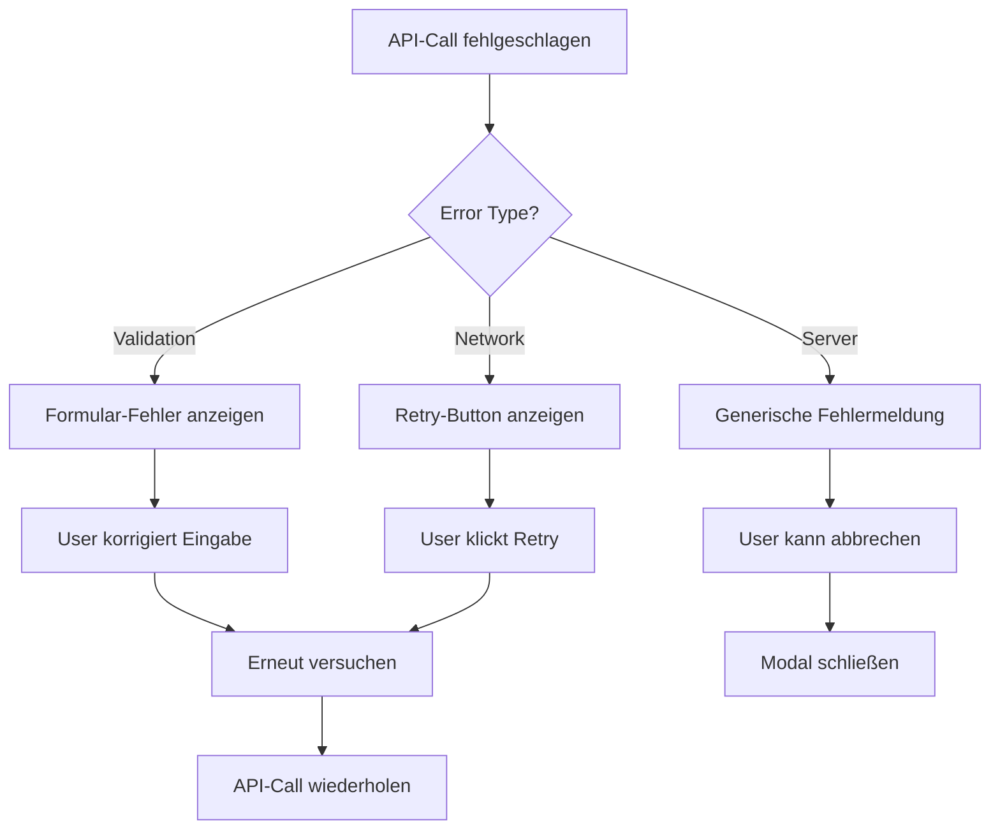

# Story 9.4: Inline-Entity-Creation

## 📋 **STORY DETAILS**

**Epic**: 9 - Erweiterte Projekt-Verwaltung  
**Story**: 9.4  
**Titel**: Inline-Entity-Creation für alle Entitäten  
**Status**: 🔄 PENDING  
**Priorität**: MITTEL  
**Aufwand**: 1 Tag  
**Entwickler**: @dev.mdc  

---

## 🎯 **USER STORY**

**Als** Benutzer (alle Rollen)  
**möchte ich** neue Entitäten (Kategorien, Lieferanten, Teams, Tags) direkt aus Dropdowns heraus erstellen können  
**damit** ich den Projekt-Erstellungsflow nicht unterbrechen muss.

---

## 📝 **BESCHREIBUNG**

Implementierung einer universellen Inline-Entity-Creation für alle Entitätstypen direkt aus Dropdown-Menüs:

### **Unterstützte Entitäten**
1. **Kategorien**: Projekt-Kategorien mit Typ und Sortierung
2. **Lieferanten**: Externe Dienstleister mit österreichischen Feldern
3. **Teams**: Interne Teams mit Rollen-Zuordnung
4. **Tags**: Projekt-Tags für Kategorisierung

### **Kernfunktionen**
- **Universal-Modal**: Ein Modal für alle Entitätstypen
- **Dynamische Formulare**: Felder basierend auf Entitätstyp
- **Sofortige Integration**: Neue Entität wird automatisch ausgewählt
- **Validierung**: Client- und Server-seitige Validierung
- **Berechtigungen**: Alle Benutzer können Entitäten erstellen

---

## ✅ **AKZEPTANZKRITERIEN**

### **AC1: Universal-Dropdown-Integration**
- [ ] "Neu erstellen" Option in allen Entity-Dropdowns
- [ ] Einheitliches Icon und Styling
- [ ] Keyboard-Navigation unterstützt
- [ ] Suchfunktion berücksichtigt "Neu erstellen" Option

### **AC2: Dynamisches Entity-Modal**
- [ ] Ein Modal für alle Entitätstypen
- [ ] Dynamische Formular-Generierung basierend auf Entitätstyp
- [ ] Responsive Design für alle Bildschirmgrößen
- [ ] Accessibility-Standards erfüllt (WCAG 2.1)

### **AC3: Entitätsspezifische Formulare**
- [ ] **Kategorien**: Name, Typ, Beschreibung, Sortierung, Parent-Kategorie
- [ ] **Lieferanten**: Firmenname, UID, Adresse, Kontakt, IBAN
- [ ] **Teams**: Name, Beschreibung, Rollen-Auswahl, Aktiv-Status
- [ ] **Tags**: Name, Farbe, Beschreibung, Aktiv-Status

### **AC4: Sofortige Integration**
- [ ] Neue Entität wird automatisch im Dropdown ausgewählt
- [ ] Dropdown-Liste wird aktualisiert ohne Seiten-Reload
- [ ] Optimistische UI-Updates mit Rollback bei Fehlern
- [ ] Loading-States während Erstellung

### **AC5: Validierung und Fehlerbehandlung**
- [ ] Client-seitige Validierung mit sofortigem Feedback
- [ ] Server-seitige Validierung mit detaillierten Fehlermeldungen
- [ ] Duplikats-Prüfung für Namen/UIDs
- [ ] Graceful Error Handling mit Retry-Mechanismus

---

## 🛠️ **TECHNISCHE ANFORDERUNGEN**

### **Frontend-Komponenten**
```typescript
// Universal-Komponente
InlineEntityCreator.tsx
├── EntityModal.tsx
├── DynamicEntityForm.tsx
├── EntityFormFields/
│   ├── CategoryFields.tsx
│   ├── SupplierFields.tsx
│   ├── TeamFields.tsx
│   └── TagFields.tsx
└── EntityDropdownWithCreate.tsx

// Typen
interface EntityCreationProps {
  entityType: 'categories' | 'suppliers' | 'teams' | 'tags';
  onEntityCreated: (entity: any) => void;
  onCancel: () => void;
}

interface EntityFormData {
  categories: {
    name: string;
    kategorie_typ: string;
    beschreibung?: string;
    sortierung: number;
    parent_id?: string;
    is_active: boolean;
  };
  suppliers: {
    name: string;
    uid?: string;
    address: string;
    contact_person?: string;
    email?: string;
    phone?: string;
    iban?: string;
    is_active: boolean;
  };
  teams: {
    name: string;
    beschreibung?: string;
    selectedRoles: string[];
    is_active: boolean;
  };
  tags: {
    name: string;
    color: string;
    beschreibung?: string;
    is_active: boolean;
  };
}
```

### **API-Integration**
```javascript
// Erweiterte Entity-Creation APIs
POST /api/categories    // Kategorie erstellen
POST /api/suppliers     // Lieferant erstellen  
POST /api/teams         // Team erstellen (mit Rollen)
POST /api/tags          // Tag erstellen

// Response Format (einheitlich)
{
  success: true,
  data: {
    id: "uuid",
    name: "Entity Name",
    // ... weitere Felder
  },
  message: "Entity erfolgreich erstellt"
}

// Error Format (einheitlich)
{
  success: false,
  error: {
    code: "VALIDATION_ERROR",
    message: "Validierungsfehler",
    details: {
      field: "name",
      message: "Name ist bereits vergeben"
    }
  }
}
```

### **State Management**
```typescript
// Entity Creation State
interface EntityCreationState {
  isOpen: boolean;
  entityType: EntityType | null;
  isLoading: boolean;
  error: string | null;
  formData: Partial<EntityFormData>;
}

// Actions
const entityCreationSlice = createSlice({
  name: 'entityCreation',
  initialState,
  reducers: {
    openModal: (state, action) => {
      state.isOpen = true;
      state.entityType = action.payload.entityType;
      state.formData = getDefaultFormData(action.payload.entityType);
    },
    closeModal: (state) => {
      state.isOpen = false;
      state.entityType = null;
      state.error = null;
      state.formData = {};
    },
    setFormData: (state, action) => {
      state.formData = { ...state.formData, ...action.payload };
    },
    createEntityStart: (state) => {
      state.isLoading = true;
      state.error = null;
    },
    createEntitySuccess: (state, action) => {
      state.isLoading = false;
      state.isOpen = false;
      // Optimistic update in parent component
    },
    createEntityError: (state, action) => {
      state.isLoading = false;
      state.error = action.payload;
    }
  }
});
```

---

## 🎨 **UI/UX DESIGN**

### **Dropdown mit "Neu erstellen" Option**
```
┌─ Kategorie auswählen ─────────────────────────┐
│ ┌───────────────────────────────────────────┐ │
│ │ 🔍 Suchen...                             │ │
│ └───────────────────────────────────────────┘ │
│                                             │
│ ○ Softwareentwicklung                       │
│ ○ Marketing & Vertrieb                      │
│ ○ Infrastruktur                             │
│ ─────────────────────────────────────────── │
│ ○ ➕ Neue Kategorie erstellen               │
└─────────────────────────────────────────────┘
```

### **Universal Entity-Modal**
```
┌─ Neue Kategorie erstellen ────────────────────┐
│                                               │
│ Name *                                        │
│ [Softwareentwicklung                        ] │
│                                               │
│ Typ *                                         │
│ [Hauptkategorie        ▼]                     │
│                                               │
│ Beschreibung                                  │
│ [Projekte im Bereich der...                ] │
│ [                                           ] │
│                                               │
│ Sortierung                                    │
│ [10                    ]                      │
│                                               │
│ Parent-Kategorie                              │
│ [Keine                 ▼]                     │
│                                               │
│ ☑️ Aktiv                                      │
│                                               │
│ [Abbrechen] [Erstellen]                       │
└───────────────────────────────────────────────┘
```

### **Lieferanten-Formular (Österreich-spezifisch)**
```
┌─ Neuen Lieferanten erstellen ─────────────────┐
│                                               │
│ Firmenname *                                  │
│ [Acme Solutions GmbH                        ] │
│                                               │
│ UID (Österreich)                              │
│ [ATU12345678                                ] │
│                                               │
│ Adresse *                                     │
│ [Musterstraße 123                           ] │
│ [1010 Wien, Österreich                      ] │
│                                               │
│ Kontaktperson                                 │
│ [Max Mustermann                             ] │
│                                               │
│ E-Mail                                        │
│ [max@acme.at                                ] │
│                                               │
│ Telefon                                       │
│ [+43 1 234 5678                             ] │
│                                               │
│ IBAN                                          │
│ [AT12 3456 7890 1234 5678                   ] │
│                                               │
│ ☑️ Aktiv                                      │
│                                               │
│ [Abbrechen] [Erstellen]                       │
└───────────────────────────────────────────────┘
```

---

## 🔄 **WORKFLOW**

### **Inline-Creation Workflow**
```mermaid
graph TD
    A[User klickt Dropdown] --> B[Dropdown öffnet]
    B --> C[User wählt "Neu erstellen"]
    C --> D[Modal öffnet mit Entity-Form]
    D --> E[User füllt Formular aus]
    E --> F[Client-Validierung]
    F --> G{Valid?}
    G -->|Nein| H[Fehler anzeigen]
    H --> E
    G -->|Ja| I[API-Call senden]
    I --> J[Server-Validierung]
    J --> K{Valid?}
    K -->|Nein| L[Server-Fehler anzeigen]
    L --> E
    K -->|Ja| M[Entity erstellt]
    M --> N[Dropdown aktualisieren]
    N --> O[Neue Entity auswählen]
    O --> P[Modal schließen]
```

### **Error Handling Workflow**


---

## 🧪 **TESTING**

### **Unit Tests**
```javascript
describe('InlineEntityCreator', () => {
  test('renders correct form fields for each entity type');
  test('validates form data client-side');
  test('handles API success response');
  test('handles API error response');
  test('updates dropdown after successful creation');
});

describe('DynamicEntityForm', () => {
  test('generates category form fields');
  test('generates supplier form fields');
  test('generates team form fields');
  test('generates tag form fields');
  test('validates required fields');
  test('validates field formats (email, IBAN, etc.)');
});
```

### **Integration Tests**
```javascript
describe('Inline Entity Creation Integration', () => {
  test('creates category and selects it in dropdown');
  test('creates supplier with Austrian fields');
  test('creates team with role assignments');
  test('creates tag with color selection');
  test('handles duplicate name validation');
  test('handles network errors gracefully');
});
```

### **Browser Tests (MCP)**
```javascript
// E2E Test-Szenario: Kategorie-Erstellung
1. Projekt-Formular öffnen
2. Kategorie-Dropdown klicken
3. "Neue Kategorie erstellen" wählen
4. Modal öffnet sich ✅
5. Kategorie-Daten eingeben
6. "Erstellen" klicken
7. Modal schließt sich ✅
8. Neue Kategorie ist im Dropdown ausgewählt ✅

// E2E Test-Szenario: Lieferanten-Erstellung
1. Extern-Sektion → Dienstleister hinzufügen
2. "Neuen Lieferanten erstellen" wählen
3. Österreichische Felder ausfüllen (UID, IBAN)
4. Validierung prüfen (E-Mail-Format, IBAN-Format)
5. Lieferant erstellen
6. Automatische Auswahl im Multi-Dienstleister-System ✅

// E2E Test-Szenario: Error Handling
1. Duplikat-Name eingeben
2. Server-Validierungsfehler erhalten ✅
3. Fehler im Formular anzeigen ✅
4. Name korrigieren
5. Erfolgreich erstellen ✅
```

---

## 📊 **DEFINITION OF DONE**

- [ ] Alle Akzeptanzkriterien erfüllt
- [ ] Universal-Modal für alle Entitätstypen implementiert
- [ ] Dynamische Formular-Generierung funktional
- [ ] Client- und Server-seitige Validierung
- [ ] Optimistische UI-Updates mit Rollback
- [ ] Unit Tests geschrieben (>90% Coverage)
- [ ] Integration Tests bestanden
- [ ] Browser-Tests erfolgreich
- [ ] Accessibility-Tests bestanden (WCAG 2.1)
- [ ] Performance-Tests bestanden (<200ms Modal-Öffnung)
- [ ] Code Review abgeschlossen
- [ ] Dokumentation aktualisiert

---

## 🔗 **ABHÄNGIGKEITEN**

### **Voraussetzungen**
- Story 9.1: Semantische UI-Struktur
- Story 9.2: Multi-Dienstleister-System
- Entity-CRUD-APIs vollständig funktional
- Form-Validierungs-System

### **Nachfolgende Stories**
- Story 9.5: Kosten-Übersicht

---

## 📝 **IMPLEMENTIERUNGS-NOTIZEN**

### **Technische Hinweise**
- Verwendung von React Hook Form für Form-Management
- Zod für Schema-Validierung (client- und server-seitig)
- React Query für optimistische Updates
- Framer Motion für Modal-Animationen

### **Performance-Optimierungen**
- Lazy Loading des Entity-Modals
- Debounced Validierung für bessere UX
- Memoization für teure Form-Berechnungen
- Virtualisierung bei großen Dropdown-Listen

### **Accessibility-Anforderungen**
- ARIA-Labels für alle Form-Elemente
- Keyboard-Navigation im Modal
- Screen-Reader-Ankündigungen für Erfolg/Fehler
- Fokus-Management beim Modal-Öffnen/Schließen

### **Sicherheitsaspekte**
- Input-Sanitization für alle Felder
- CSRF-Protection für API-Calls
- Rate-Limiting für Entity-Creation
- Berechtigungsprüfung server-seitig


